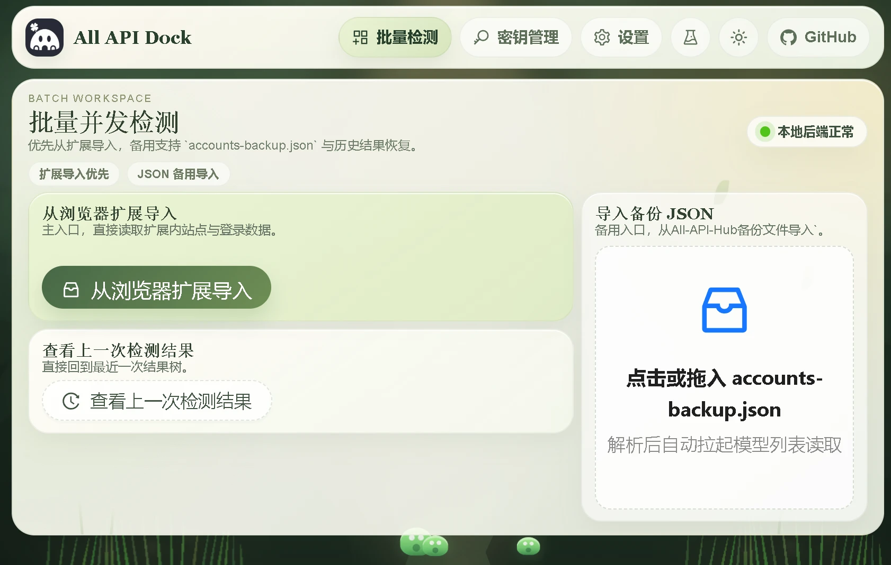

# All API Dock

[中文](./README.md) | [English](./README.en.md)

桌面端批量 API 检测与密钥整理工具。

当前项目基于 `Wails + Vue 3`，主要服务于以下几类场景：

- 从浏览器扩展或备份文件导入站点账号
- 批量读取各站点模型列表，高效筛选强自定义，便捷地从海量站点中寻找有效自选模型
- 批量检测模型可用性、余额、快速对话能力
- CCSwitch能力的本地密钥面板，支持Windows侧边栏快速查看状态切换密钥
- 切换模型时候有清晰的改动对照、切换后可支持历史对话
- 一键切换 Claude / Codex / OpenCode / OpenClaw 等桌面客户端配置&&预览

## 界面预览



## 当前定位

这不是纯网页工具，而是偏桌面工作流的本地应用。

项目目前包含三层能力：

- 桌面壳：`Wails`
- 前端界面：`Vue 3 + Ant Design Vue + Vite`
- 本地后端逻辑：`Go`

## 主要功能

### 1. 扩展导入优先

支持优先从浏览器扩展ALL-API-HUB数据文件直接导入站点与账号信息，适合已有扩展使用场景。
比较方便，推荐

### 2. 备份 JSON 导入

支持导入ALL-API-HUB插件导出的标准备份文件，例如：

- `accounts-backup.json`
- `accounts-backup-2026-04-01.json`

### 3. 批量模型发现

对导入的多个站点并发拉取模型列表，并支持失败诊断、状态追踪与标签分组。

### 4. 批量可用性检测

支持对选定站点与模型执行批量检测，输出：

- 可用 / 异常状态
- 错误码
- 常见原因说明
- 调研 trace 日志
- fetch 复现片段

### 5. 本地 Profile / CDP 双模式

支持两类登录态读取模式：

- `Profile 文件模式`
- `CDP 重开模式`

设置页可切换，便于在不同站点兼容性之间取舍。

### 6. 侧边面板

支持最小化到托盘后使用侧边面板管理密钥记录，包括：

- 快速刷新余额
- 快速测试
- 选择模型
- 打开专属一键配置窗口

### 7. 专属一键配置

支持基于当前选中的站点记录，生成桌面客户端配置变更预览，并写入本机配置文件。

当前已覆盖的典型目标应用包括：

- Claude
- Codex
- OpenCode
- OpenClaw

## 项目结构

```text
.
├─ src/                     前端页面与组件
├─ wailsjs/                 Wails 绑定代码
├─ build/                   构建输出
├─ logs/                    运行日志
├─ scripts/                 开发与构建脚本
├─ main.go                  Wails 入口
├─ app.go                   应用生命周期与后端主逻辑
├─ window_sidebar.go        托盘 / 侧边面板窗口逻辑
└─ local_api.go             本地接口与请求处理
```

## 开发环境

建议环境：

- Windows 10/11
- Go 1.24+
- Node.js 24+
- npm 11+
- WebView2 Runtime

## 开发启动

安装依赖：

```bash
npm install
```

桌面开发模式：

```bash
npm run dev
```

仅前端开发：

```bash
npm run dev:web
```

## 构建

桌面构建：

```bash
wails build
```

或：

```bash
npm run build:desktop
```

构建产物默认位于：

```text
build/bin/
```

## 日志

设置里也可获取，对应日志目录：

```text
logs/
```

其中通常会包含：

- `EXE_BACKEND_DEBUG.log`
- `wails-dev-host.log`
- `wails-dev-runner.log`
- `wails-dev-vite.log`

## GitHub

项目主页：

https://github.com/jlwebs/AllApiDeck
