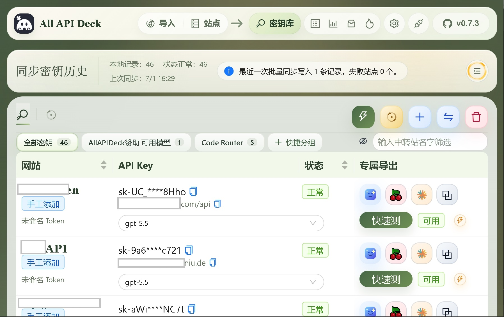
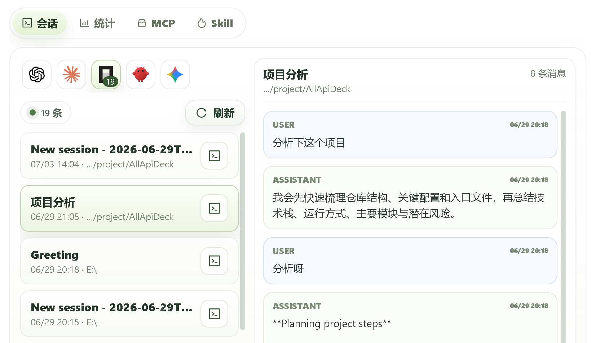
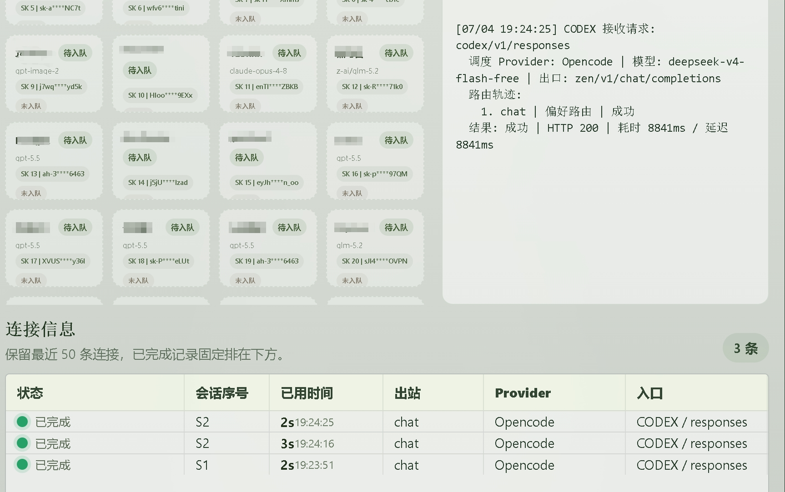
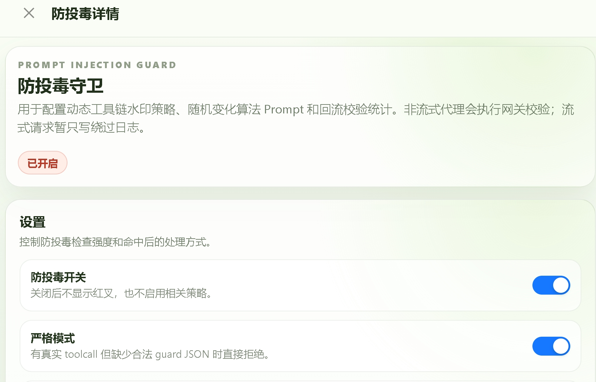
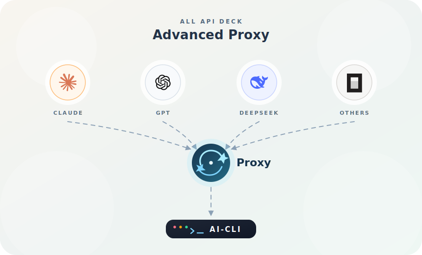
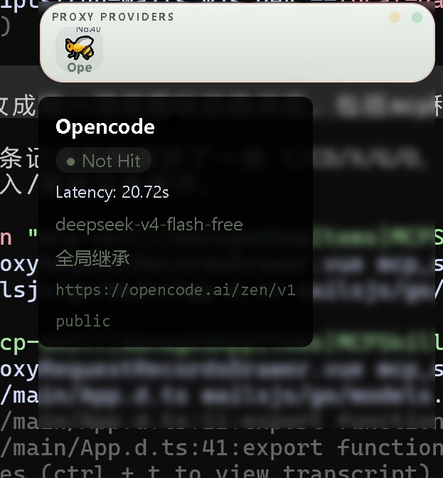

<div align="center">


# All API Deck

**面向海量中转站、API Key、本地 AI 客户端和高级代理调度的桌面控制台**

把导入、同步、测活、分组、模型发现、会话观察、MCP / Skill 管理、客户端接管、防投毒守卫和请求排障放进一套桌面工作流。

<p align="center">
<a href="https://github.com/jlwebs/AllApiDeck/releases">
  
</a><!--
--><a href="https://github.com/jlwebs/AllApiDeck/stargazers">
  
</a><!--
--><a href="https://deepwiki.com/jlwebs/AllApiDeck">
  
</a><!--
--><a href="LICENSE">
  
</a><!--
--><!--
-->
<!--
-->
</p>

<p align="center">
  <a href="README.md"><strong>中文</strong></a> |
  <a href="desktop/docs/readme/README.en.md">English</a>
</p>

</div>

## 总览

All API Deck 不是“测一个接口能不能用”的临时小工具，而是面向长期维护大量站点、key、模型和本地 AI 客户端的一套桌面工作台。

它适合这类场景：

- 你在多个公益站、自建站、聚合站之间切换，需要统一保存和筛选 API key。
- 你经常要确认某个模型在哪些站点可用，哪些 key 当前可用，性能如何。
- 你要把 Claude、Codex、OpenCode、OpenClaw 接到稳定的本地代理入口。
- 你需要观察 provider 队列、路由 fallback、真实上游出口和最近连接记录。
- 你担心动态工具链、toolcall 和上游响应被污染，希望在本地网关层做可验证防护。

## 核心工作流

| 阶段 | 你要做的事 | All API Deck 提供的能力 |
|---|---|---|
| 导入 | 把分散的站点、账号、key 收进桌面端 | 浏览器扩展桥接、ALL-API-HUB 备份 JSON、目录扫描、剪贴板批量导入 |
| 整理 | 让大量记录变成可维护资产 | 密钥库、分组、状态筛选、站点搜索、专属导出 |
| 判断 | 找出真实可用的模型和 key | 批量模型发现、快速测活、TTFT / TPS / Latency、协议探测 |
| 接管 | 让客户端走本地稳定入口 | Claude / Codex / OpenCode / OpenClaw 配置预览与写入 |
| 调度 | 处理不同上游之间的协议差异 | provider 队列、故障转移、`messages` / `responses` / `chat/completions` fallback |
| 排障 | 复现失败请求和慢请求 | 请求记录、路由轨迹、连接信息、可编辑 `fetch(...)` 复测 |
| 防护 | 降低工具链投毒和响应污染风险 | 动态 guard Prompt、字符串保护、toolcall 回流校验、严格模式 |

## 新版界面

<table>
  <tr>
    <td width="50%">
      
      <br><strong>同步密钥库</strong><br>
      本地记录、状态正常数量、同步历史、分组筛选、站点搜索、快速测活和专属导出集中在一处。
    </td>
    <td width="50%">
      
      <br><strong>会话 / MCP / Skill</strong><br>
      查看项目会话、消息历史、MCP 入口、Skill 状态和多客户端上下文。
    </td>
  </tr>
  <tr>
    <td width="50%">
      
      <br><strong>高级代理连接</strong><br>
      展示 provider 队列、模型、入口、出口、路由轨迹、耗时、HTTP 状态和最近连接。
    </td>
    <td width="50%">
      
      <br><strong>防投毒守卫</strong><br>
      配置动态工具链水印策略、随机 Prompt、回流校验统计和严格模式。
    </td>
  </tr>
</table>

## 高级代理流转图

<p align="center">
  
</p>

## 功能模块

### 1. 同步密钥库

新版主工作区围绕密钥库组织：

- 显示本地记录数、状态正常数、上次同步时间和最近一次批量同步结果。
- 按全部密钥、自定义分组、快捷分组和站点名称筛选。
- 单条记录支持复制 key / base URL、选择模型、快速测活和状态观察。
- 专属导出可把可用记录送到对应客户端配置流程。

### 2. 导入与迁移

支持把已有记录快速迁移到桌面端：

- 浏览器扩展桥接导入。
- ALL-API-HUB 备份 JSON 导入。
- 扩展目录 / 数据目录扫描导入。
- 剪贴板批量导入 API key。

常见备份文件名：

- `accounts-backup.json`
- `accounts-backup-2026-04-01.json`

### 3. 批量模型发现与快速测活

导入后通常先做两件事：

1. 批量拉取模型列表，确认每个站点真实支持的模型集合。
2. 对目标模型快速测活，确认 key 当前是否可用。

检测结果会保留：

- 成功 / 失败状态和失败原因。
- 状态码、TTFT、TPS、Latency。
- 协议探测和 fallback 结果。
- 复现所需的请求信息。

### 4. 会话、MCP 与 Skill 面板

All API Deck 不只管理 key，也开始覆盖本地 AI 工具链的可观察性：

- 按项目路径和时间查看历史会话。
- 查看用户与助手消息，快速回溯任务上下文。
- 观察 MCP 服务、Skill 状态和多入口客户端。
- 减少在不同客户端、配置文件和日志之间切换。

### 5. 侧栏、miniBar 与悬窗

侧栏 / miniBar / 悬窗适合主窗口之外的持续观察和快速操作。

<p align="center">
    
</p>

支持：

- 在 miniBar / 侧栏 / 悬窗里快速查看记录状态。
- 对单条记录快速刷新、快速测活、切换模型。
- 查看当前 provider 队列和实时调度命中项。
- 观察调度状态、组织调用集群和定位异常请求。

> Windows 下侧栏 / 悬窗体验最完整；非 Windows 环境可通过 miniBar / 独立窗体使用类似能力。

### 6. 桌面客户端一键接管

当前覆盖的典型目标应用：

- Claude
- Codex
- OpenCode
- OpenClaw

基于当前选中的站点记录，All API Deck 可以生成配置预览并写入本机配置文件，减少手动编辑 base URL、token、模型和协议参数的重复劳动。

### 7. 高级代理

高级代理让上层客户端尽量只面对一个稳定本地端点，把协议差异、失败重试和路由选择留在代理层处理。

支持：

- provider 优先级队列。
- 自动故障转移。
- `messages` / `responses` / `chat/completions` 多协议 fallback。
- 按 host / key / model 记忆协议偏好。
- 请求整流修正。
- `invalid_encrypted_content` 自动愈合。
- 调度状态可视化。
- 请求记录与路由追踪。

典型例子：

- 某个上游只支持 `chat/completions`，但客户端默认走 `responses`。
- 某个 Claude 兼容上游只接受 `/v1/messages`。
- 同一 host 上不同模型支持的协议不一致。

### 8. 请求记录与调试

请求记录面板保存高级代理近期请求的关键信息：

- 入口 / 出口。
- 实际上游 URL。
- 路由 fallback 轨迹。
- 状态码。
- 耗时、TTFT、Latency、TPS。
- 输入 / 输出 token。
- 错误摘要。

最近 50 条请求还会在内存中保留完整 request body。打开详情后可以查看格式化请求内容，生成完整 `fetch(...)` 调试命令，并修改 headers / body / URL 后直接复测。

### 9. 防投毒守卫

防投毒模块不是让模型“自己判断自己是否安全”，而是在本地高级代理网关层建立可验证的回流校验机制。

核心机制：

- 请求发往上游前注入本轮动态 guard 规则 Prompt。
- 如果模型准备输出真实 toolcall，必须先输出 `<aad_guard_json>...</aad_guard_json>`。
- guard JSON 使用最小绑定字段 `name` 和 `tool_name`。
- 网关在响应回流时提取真实 toolcall 和 guard JSON，校验二者是否匹配。
- 校验失败时按配置阻断或告警；通过后剥离 guard JSON，再返回客户端。
- 对 key、secret、敏感工具结果和用户主动 `<<...>>` 标记内容做字符串保护与还原。

更多细节：

- [防投毒设计 Wiki](anti-poison-wiki.md)
- [防投毒测试结果](anti-poison-result.md)
- [本地投毒 Demo 半小时评估报告](anti-poison-demo-eval-report.md)

## 适合谁

- 有大量中转站 / key / 模型组合，需要集中管理。
- 已经在浏览器扩展或备份文件里积累了很多记录，想迁移到桌面端。
- 需要高频做模型发现、批量测试、快速筛选和分组维护。
- 需要给 Claude / Codex / OpenCode / OpenClaw 接入本地代理。
- 经常遇到协议不兼容、模型错配、错误复现困难。
- 希望把“导入、测活、分组、接管客户端、观察调度、排查失败、防护 toolcall 污染”放在一个桌面工具里完成。

## 快速开始

### 1. 下载桌面版

从 Releases 下载对应平台版本：

https://github.com/jlwebs/AllApiDeck/releases

当前 GitHub Release 会附带这些产物：

- Windows：`allapideck-windows-amd64.exe`
- Windows：`allapideck-windows-amd64.msi`
- macOS：`allapideck-macos-universal.dmg`
- Linux：`allapideck-linux-amd64.tar.gz`
- Linux：`allapideck-linux-amd64.deb`
- Linux：`allapideck-linux-amd64.AppImage`

Windows 自动更新当前优先选择并拉起 `.msi` 安装包，`.exe` 作为兼容兜底资产保留。

### 2. 导入站点记录

推荐优先使用：

- 浏览器扩展桥接导入。
- ALL-API-HUB 备份 JSON 导入。

### 3. 批量拉模型 / 快速测活

导入后通常先批量拉取模型列表，再对目标模型做快速测活。这样可以快速判断：

- 哪些站点真的有这个模型。
- 哪些 key 当前可用。
- 哪些站点需要切协议或不适合接入桌面客户端。

### 4. 按需开启高级代理接管

如果你要让 Claude / Codex / OpenCode / OpenClaw 走本地高级代理：

1. 在“高级代理功能”里配置 provider 队列。
2. 为目标应用开启接管。
3. 在配置预览里确认 base URL、token、协议类型和模型。
4. 写入本机配置。
5. 通过请求记录和连接信息观察实际路由。

## 项目结构

```text
.
├─ desktop/                          桌面端项目主目录
│  ├─ src/                           Vue 前端页面与组件
│  ├─ wailsjs/                       Wails 绑定代码
│  ├─ scripts/                       开发、打包、安装脚本
│  ├─ docs/                          文档与截图
│  ├─ build/                         桌面构建输出
│  ├─ release-assets/                CI 产物暂存目录
│  ├─ main.go                        Wails 入口
│  ├─ app.go                         应用生命周期与后端主逻辑
│  ├─ advanced_proxy_*.go            高级代理相关逻辑
│  ├─ local_api.go                   本地测活 / 协议探测逻辑
│  └─ window_sidebar.go              托盘 / 侧边栏窗口逻辑
├─ anti-poison-wiki.md               防投毒设计说明
├─ anti-poison-result.md             防投毒测试结果
└─ .github/workflows/                发布与 CI 配置
```

## 技术栈

- 桌面壳：`Wails`
- 前端界面：`Vue 3 + Ant Design Vue + Vite`
- 本地后端逻辑：`Go`
- 打包与发布：`GitHub Actions + Wails + 平台补充脚本`

## 开发环境

建议环境：

- Windows 10/11
- Go 1.24+
- Node.js 24+
- npm 11+
- WebView2 Runtime

> 目前 Windows 是主要开发和验证环境，部分功能（尤其侧栏 / miniBar / 某些桌面客户端接管体验）在 Windows 下最完整。

## 本地开发

安装依赖：

```bash
cd desktop
npm install
```

桌面开发模式：

```bash
npm run dev
```

仅前端开发：

```bash
npm run dev:web
```

## 构建

标准桌面构建：

```bash
npm run build:desktop
```

调试版桌面构建：

```bash
npm run build:desktop-debug
```

仅前端构建：

```bash
npm run build:web
```

构建产物默认位于：

```text
desktop/build/bin/
```

## 日志与运行时目录

程序运行时目录不是固定写在仓库里，而是落到系统运行时目录中。

典型位置：

- Windows：`%LOCALAPPDATA%\BatchApiCheck\runtime`
- macOS：`~/Library/Application Support/BatchApiCheck/runtime`
- Linux：`$XDG_STATE_HOME` / `$XDG_CACHE_HOME` 下的 `batch-api-check/runtime`

日志通常位于：

```text
runtime/logs/
```

常见日志文件包括：

- `advanced-proxy.log`
- `EXE_BACKEND_DEBUG.log`
- `client-runtime.log`
- `wails-dev-host.log`
- `wails-dev-runner.log`
- `wails-dev-vite.log`

## 发布方式

仓库使用 GitHub Actions 自动构建桌面版 release 资产。

当前发布工作流会在打 tag 后自动：

- 构建 Windows / macOS / Linux 产物。
- 为 Windows 额外生成 `.msi`。
- 为 Linux 额外组装 `.deb` 与 `.AppImage`。
- 上传到对应 GitHub Release。

## 项目主页

https://github.com/jlwebs/AllApiDeck

## 致谢

感谢 [Linux.do](https://linux.do/) 社区提供的反馈、测试和传播支持。
