# AllApiDeck 防投毒 Wiki

本文档说明 AllApiDeck Advanced Proxy 的防投毒能力，包括威胁模型、核心原理、链路结构、配置项、日志统计、测试覆盖和已知边界。

## 1. 总览

防投毒模块的目标不是让模型“自己判断自己是否安全”，而是在本地高级代理网关层建立一套可验证的回流校验机制。

核心思路：

1. 请求发往上游模型前，网关动态注入一段带 nonce 的防投毒策略 Prompt，并注册一个本轮专属的 guard fake tool。
2. 如果模型返回任何真实 toolcall，必须额外返回 guard fake toolcall。
3. 网关在响应回流时重新提取真实 toolcall 链路，计算 digest，并校验 guard fake toolcall 中的 nonce、algorithm alias、digest、chain、cover。
4. 校验失败时立即阻断，不继续 fallback，不把疑似投毒内容交给客户端。
5. 对配置/密钥样式字符串，在 request out 阶段替换为占位符，respond in 阶段再还原，降低读取配置文件后被注入文本诱导泄露的风险。

### 一图看懂

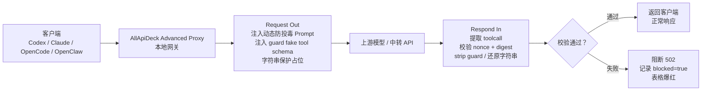

## 2. 防护对象和威胁模型

防投毒主要面向“响应链路被污染”以及“读取配置文件后被注入内容诱导”的风险。

| 风险类别 | 典型场景 | 防护目标 |
|---|---|---|
| 响应 toolcall 注入 | 上游响应中被插入未授权工具调用 | 阻断缺 guard 或 digest 不匹配的真实 toolcall |
| 参数定向篡改 | 工具名不变，但命令、路径、URL、arguments 被替换 | digest 覆盖 canonical arguments，参数变化会被发现 |
| 伪造调用链 | 响应中追加、删除、重排 toolcall | digest 覆盖顺序、工具类型、工具名、call_id 摘要、参数 hash |
| 重放旧 guard | 复用上一轮 guard fake toolcall | nonce、guard tool name、algorithm alias 每轮变化 |
| 多协议混淆 | OpenAI Chat / Responses / Claude Messages 结构不同 | 分协议解析，统一进入校验器 |
| 配置字符串泄露 | `.env`、`.npmrc`、JSON key、token 等进入上游 | request out 替换占位符，respond in 还原 |
| 阻断后 fallback 绕过 | 安全失败被当成普通上游失败继续 fallback | anti-poison blocked 硬终止本次请求 |

不在防护范围内：

| 不防护内容 | 原因 |
|---|---|
| 模型本身已经恶意 | 如果模型主动恶意配合攻击，任何 Prompt 约束都不可靠 |
| 流式响应中的实时 toolcall 校验 | 当前流式请求只写绕过日志，完整防护用于非流式代理 |
| 客户端本地已执行的外部副作用 | 网关只能阻断回流前检测到的内容，不能回滚已执行外部系统副作用 |
| 完全绕过代理的请求 | 防投毒逻辑位于 Advanced Proxy 网关内 |

## 3. 核心术语

| 术语 | 含义 |
|---|---|
| 网关 | AllApiDeck Advanced Proxy，本地请求/响应中转层 |
| nonce | 每轮请求生成的随机种子，用于绑定本轮防投毒策略和校验结果 |
| algorithm alias | 随机变化算法代号，仅用于把策略 Prompt 和算法 Prompt 关联起来，本身无安全含义 |
| guard fake toolcall | 模型在真实 toolcall 之外额外生成的校验用 fake toolcall，不是用户真实请求 |
| digest | 网关基于真实 toolcall 链路重新计算的摘要 |
| chain | guard fake toolcall 中携带的调用链摘要 |
| cover | guard fake toolcall 中携带的工具类别覆盖摘要 |
| request out | 请求发往上游前的处理通路 |
| respond in | 上游响应回客户端前的处理通路 |
| string protection | 字符串保护，指敏感路径/密钥字段占位和还原 |

## 4. 模块结构

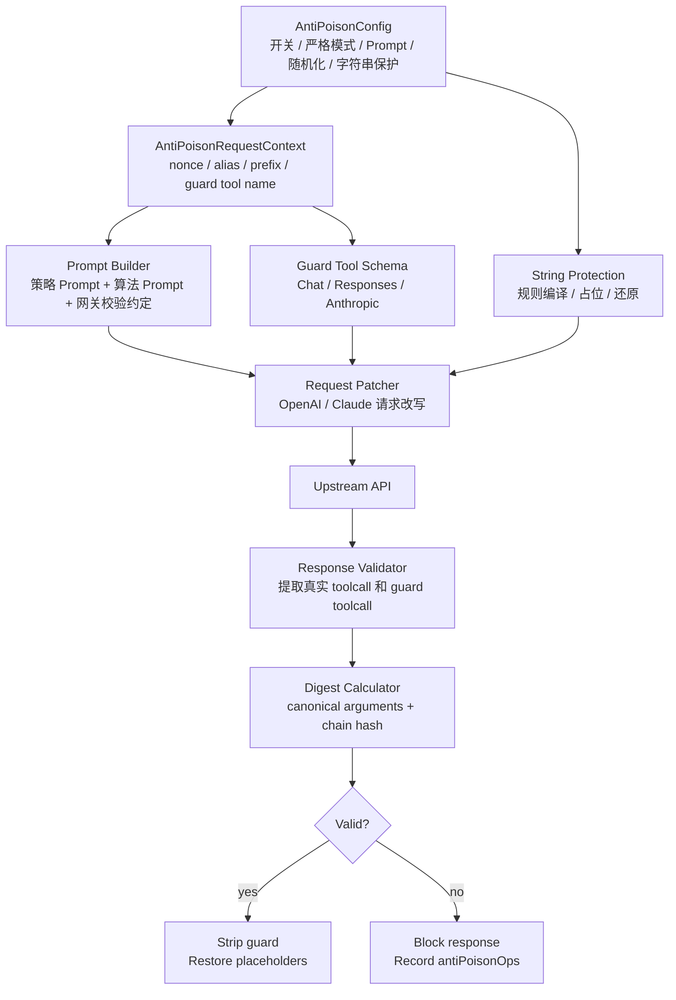

主要代码位置：

| 模块 | 文件 |
|---|---|
| 防投毒核心逻辑 | `desktop/advanced_proxy_anti_poison.go` |
| 防投毒配置和默认 Prompt | `desktop/advanced_proxy_config.go` |
| OpenAI / Claude 代理接入 | `desktop/advanced_proxy_server.go` |
| 请求记录和流水统计 | `desktop/advanced_proxy_request_records.go` |
| Claude 协议偏好和兼容 | `desktop/advanced_proxy_claude_protocol_preferences.go` |
| OpenAI Responses / Chat fallback | `desktop/advanced_proxy_openai_fallback.go` |
| 防投毒 UI 面板 | `desktop/src/components/AdvancedProxyModal.vue` |
| 前端默认配置桥接 | `desktop/src/utils/advancedProxyBridge.js` |
| 单元测试 / E2E / live soak | `desktop/advanced_proxy_anti_poison_test.go`, `desktop/advanced_proxy_server_test.go`, `desktop/advanced_proxy_anti_poison_live_test.go` |

## 5. Request Out 原理

请求发出前，网关会执行三类操作：

1. 构造本轮 `AntiPoisonRequestContext`。
2. 注入动态 Prompt 和 guard fake tool schema。
3. 对敏感字符串执行占位保护。

### Request Out 流程图

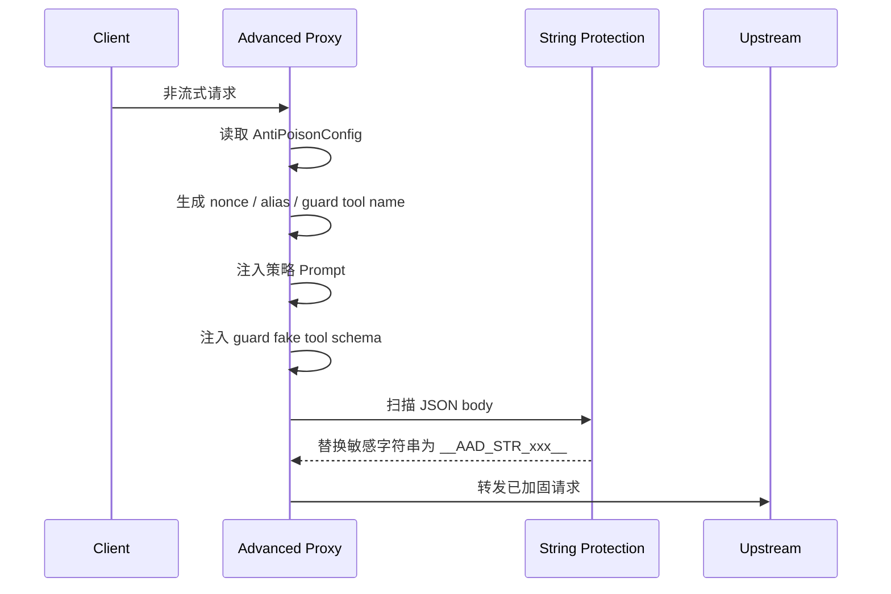

### 动态 Prompt 组成

每轮请求都会生成一份展开后的防投毒 Prompt，主要由以下内容组成：

| 段落 | 作用 |
|---|---|
| 随机变化算法代号 | 将策略段和算法段绑定到同一上下文 |
| fake toolcall prefix | 生成本轮 guard fake tool 名称 |
| guard tool name | 本轮唯一 guard fake toolcall 名称 |
| nonce | 绑定本轮请求，防止重放旧 guard |
| 策略槽 | 从策略池中选择的随机策略编号 |
| 句式变体 | 从多种表达方式中选择的随机句式 |
| 插入点位提示 | system prepend / append / tool schema tail 等随机提示 |
| 策略 Prompt | 描述何时必须生成 guard fake toolcall |
| 随机变化算法 Prompt | 描述如何组织链路摘要和 digest |
| 网关校验约定 | 明确 digest 规则和 guard fake toolcall 参数 |

### Prompt 和工具 schema 注入位置

| 协议 | Prompt 注入方式 | guard schema 注入方式 |
|---|---|---|
| OpenAI Chat Completions | prepend system message | `tools[].function` |
| OpenAI Responses | `instructions` 拼接 | `tools[]` function |
| Claude Messages | `system` 字段拼接 | Anthropic `tools[]` |
| Claude -> OpenAI Chat 兼容 | Claude system 转 OpenAI system；必要时合并进 user | OpenAI Chat tools |
| Claude -> OpenAI Responses 兼容 | Claude system 转 Responses instructions | Responses tools |

## 6. Demo 注入内容组成与可配置性

这里的“Demo 注入”指每次 request out 时网关动态拼接并发送给模型的防投毒规则包。它不是单一 Prompt，而是由“面板可配置内容、运行时随机内容、内建校验约定、工具 schema”组合而成。

### 组成总览

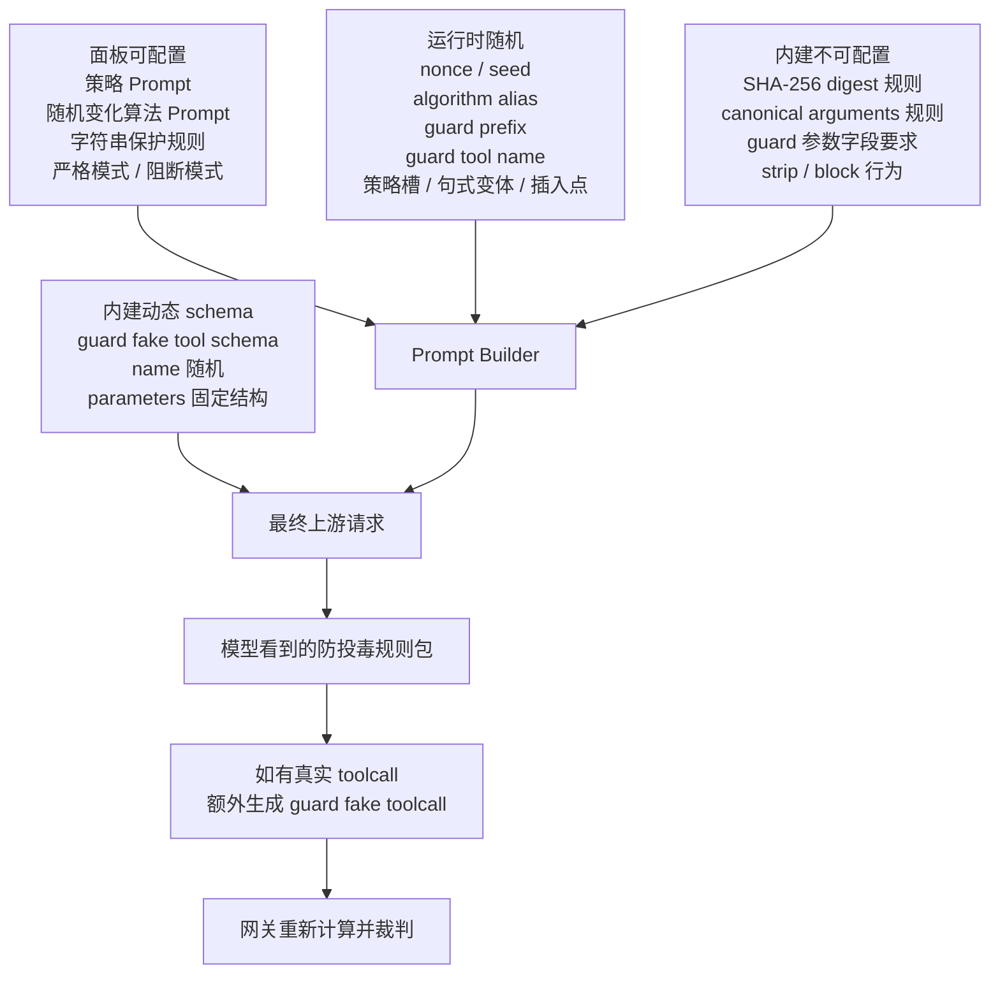

最终模型看到的是：

```text
[AllApiDeck 防投毒随机策略]
[随机变化算法代号] APTX_xxxxxxxx
[fake toolcall prefix] aad_guard_xxxxxxxxxx
[guard tool name] aad_guard_xxxxxxxxxx_trace
[nonce] <本轮随机 seed>
[策略槽] 05
[句式变体] 01
[插入点位提示] system_append

[策略 Prompt]
<面板中的 StrategyPrompt>

[随机变化算法 Prompt]
<面板中的 AlgorithmPrompt>

[网关校验约定]
<内建 digest/canonical/guard 字段规则>
```

同时请求体里还会注册一个本轮专属 guard fake tool schema，例如：

```text
tool name: aad_guard_xxxxxxxxxx_trace
parameters:
  algorithm: string
  nonce: string
  digest: string
  chain: string
  cover: string
```

### 组成项和可配置性

| 组成项 | 示例 | 来源 | 面板是否可配置 | 作用 |
|---|---|---|---|---|
| 策略 Prompt | “如果本轮产生任意真实 toolcall，请额外生成 guard fake toolcall” | `strategyPrompt` | 是 | 告诉模型何时生成 guard fake toolcall |
| 随机变化算法 Prompt | “请基于所有真实 toolcall 组织调用链摘要” | `algorithmPrompt` | 是 | 告诉模型如何组织 chain / cover / digest 所需信息 |
| 字符串保护规则 | `key:(?i)^(api_key|secret|token)$` | `stringProtection.rules` | 是 | 控制哪些字符串在 request out 被占位 |
| 防投毒开关 | `enabled=true` | `AntiPoisonConfig.enabled` | 是 | 是否启用整个模块 |
| 严格模式 | `strictMode=true` | `AntiPoisonConfig.strictMode` | 是 | 校验失败时是否直接拒绝 |
| 失败处理方式 | `block` / `warn` | `AntiPoisonConfig.failureMode` | 是 | 阻断或只写日志 |
| algorithm alias | `APTX_6BE5CF8C` | 运行时由 seed 派生 | 否，自动生成 | 绑定策略段和算法段，防重放 |
| nonce / seed | `03ecad2d767b5e4b` | 运行时随机 | 否，自动生成 | 绑定本轮请求 |
| guard prefix | `aad_guard_3497c92820` | 运行时由 seed 派生 | 否，自动生成 | 生成本轮唯一 guard tool name |
| guard tool name | `aad_guard_3497c92820_trace` | 运行时由 prefix 派生 | 否，自动生成 | 模型必须调用的 fake tool 名 |
| 策略槽 | `05` | 运行时派生 | 否，当前仅可视 | 增加 Prompt 变化性 |
| 句式变体 | `01` | 运行时派生 | 否，当前仅可视 | 增加 Prompt 变化性 |
| 插入点提示 | `system_append` | 运行时派生 | 否，当前仅可视 | 增加 Prompt 变化性 |
| SHA-256 digest 规则 | `sha256(alias + nonce + chain)[:16]` | 内建代码 | 否 | 本地网关最终校验算法 |
| canonical arguments 规则 | JSON key 排序、数组保序、字符串 JSON 转义 | 内建代码 | 否 | 保证参数 hash 稳定 |
| guard 参数字段要求 | `algorithm`, `nonce`, `digest`, `chain`, `cover` | 内建代码 + schema | 否 | 保证模型输出可被解析 |
| strip guard 行为 | 删除 guard fake toolcall 后再回客户端 | 内建代码 | 否 | 避免客户端看到内部校验工具 |
| blocked 记录 | `blocked=true`, `reason=guard_digest_mismatch` | 内建代码 | 否 | 审计和 UI 爆红 |

### 面板中能改什么，不能改什么

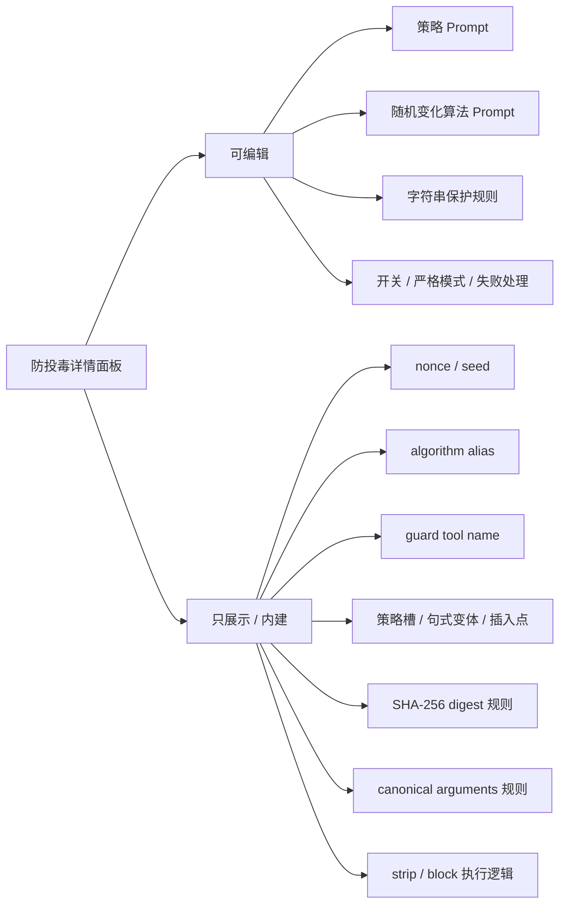

当前实现里，“随机变化算法 Prompt”可配置的是给模型看的自然语言说明，不是本地 digest 算法插件系统。也就是说：

| 问题 | 当前答案 |
|---|---|
| 面板能不能把 SHA-256 改成 MD5/CRC？ | 不能 |
| 面板能不能改模型如何描述 chain/cover？ | 能 |
| 面板能不能改什么时候生成 guard fake toolcall？ | 能 |
| 本地网关校验算法是否跟着 Prompt 自动改变？ | 不会 |
| 为什么不让面板直接改本地算法？ | 避免 Prompt 与网关校验实现不一致导致误放行或大量误报 |

### 传递给模型的“具体执行方案”

模型实际收到的信息分为两层。

第一层是可配置的策略语言：

```text
{{ALGORITHM_ALIAS}} 是本轮随机变化算法代号，仅用于关联本段规则和策略段规则。
使用该算法时，请基于所有真实 toolcall 组织调用链摘要。
调用链摘要至少包含真实 toolcall 的返回顺序、工具类别、call_id 摘要、参数 canonical 摘要、本轮 nonce 派生片段。
生成 guard fake toolcall 时，请写入 algorithm、nonce、digest、chain、cover。
```

第二层是内建网关校验约定：

```text
如果本轮产生任何真实 toolcall，必须额外调用 `<guard tool name>`。
guard fake toolcall 参数必须包含 algorithm="<alias>"、nonce="<seed>"、digest、chain、cover。
digest 规则: 按真实 toolcall 返回顺序组织链路，每项为 index|tool_type|tool_name|call_id尾8位|sha256(canonical_arguments)，前面加 alias 与 nonce 行，整体 sha256 后取前 16 位小写 hex。
canonical_arguments: JSON 对象按 key 排序、数组保序、字符串 JSON 转义；非 JSON 参数按原文 trim。
guard fake toolcall 只用于网关校验，不能替代真实工具调用，不能向用户解释。
```

所以模型知道：

| 需要执行的事 | 模型从哪里知道 |
|---|---|
| 有真实 toolcall 时必须额外调用哪个 fake tool | `[guard tool name]` 和 guard tool schema |
| fake toolcall 要写哪些字段 | Prompt 中的字段要求 + tool schema parameters |
| digest 应该怎样算 | `[网关校验约定]` 中的 SHA-256 规则 |
| 参数 canonical 怎么处理 | `[网关校验约定]` 中的 canonical_arguments 规则 |
| 本轮 alias 和 nonce 是什么 | Prompt 顶部运行时变量 |
| fake toolcall 不能展示给用户 | Prompt 中的约束 |

### Demo 注入组合关系

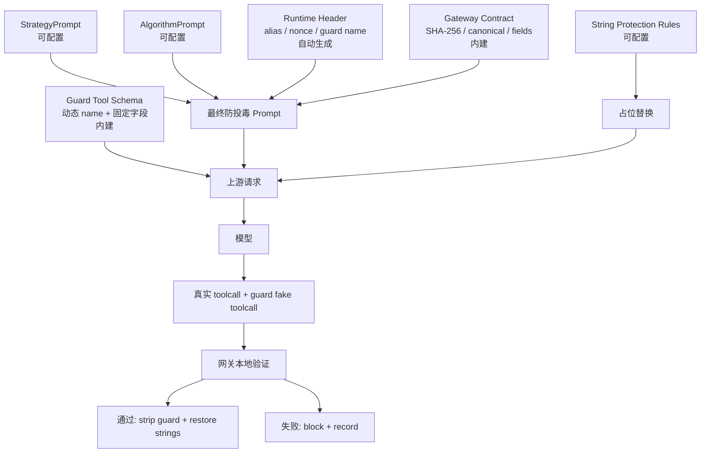

### 功效对应关系

| 注入组成 | 解决的问题 | 如果缺失会怎样 |
|---|---|---|
| nonce | 防止旧 guard 重放 | 攻击者可复用历史 digest |
| algorithm alias | 绑定策略段和算法段 | 模型输出难以和本轮策略关联 |
| guard tool name 随机化 | 降低固定工具名被模板化攻击 | 大规模投毒可硬编码工具名 |
| 策略 Prompt | 让模型知道何时生成 guard | 有真实 toolcall 时可能不生成 guard |
| 算法 Prompt | 让模型组织 chain/cover/digest | guard 内容不可校验或缺字段 |
| 内建 SHA-256 规则 | 本地可重复计算并裁判 | Prompt 只剩约定，没有硬校验 |
| canonical arguments | 防止参数换序/格式差异误判，也能发现参数篡改 | 参数 hash 不稳定或漏检 |
| guard tool schema | 让模型以结构化 toolcall 输出校验字段 | 只能解析自然语言，可靠性降低 |
| string protection rules | 避免敏感字符串进入上游 | 配置/密钥样式内容可能泄露 |
| strip / block | 防止内部 guard 泄漏或污染客户端 | 客户端会看到 fake toolcall 或继续执行恶意调用 |

### 与后续可扩展算法池的关系

当前“随机变化算法”不是 SHA/CRC/MD5 的随机算法池，而是“随机 alias + 随机 Prompt 表达 + 固定 SHA-256 网关校验”。

如果后续要扩展为真正的算法池，建议新增独立配置，而不是只改 Prompt：

| 未来算法项 | 本地实现 | 是否建议 |
|---|---|---|
| `SHA256_16` | SHA-256 取前 16 hex | 当前默认，推荐 |
| `SHA256_24` | SHA-256 取前 24 hex | 可选，误撞概率更低 |
| `HMAC_SHA256` | HMAC-SHA256 + 本地 secret | 更强，但需要本地密钥管理 |
| `CRC32_MIX` | CRC32 仅做混淆 | 不建议单独作为安全校验 |
| `MD5_COMPAT` | MD5 兼容旧系统 | 不建议作为安全校验 |

扩展时必须同时改：

1. 面板算法选择配置。
2. Prompt 中告诉模型的算法说明。
3. 网关本地 digest 计算实现。
4. E2E 测试样本。
5. blocked 统计和日志字段。

## 7. Respond In 原理

上游响应返回后，网关不会直接交给客户端，而是先进行校验：

1. 按协议提取所有真实 toolcall。
2. 提取本轮 guard fake toolcall。
3. 如果没有真实 toolcall，则无需 guard，但会 strip 掉误生成的 guard。
4. 如果有真实 toolcall，则必须满足最小 guard 数量。
5. 网关重新计算真实 toolcall 链路 digest。
6. 对比 guard fake toolcall 中的 digest。
7. 通过后 strip guard 并还原字符串占位符。
8. 失败后阻断并记录。

### Respond In 决策图

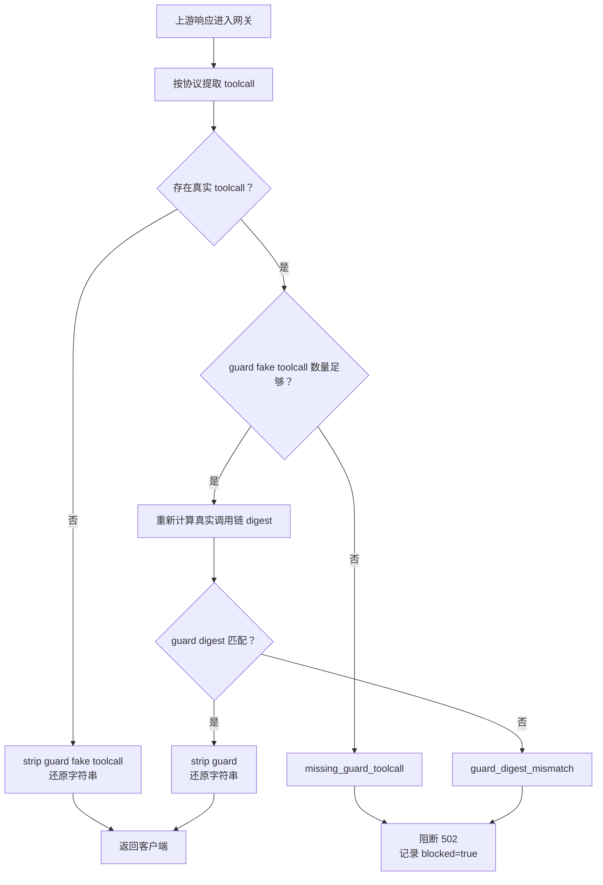

### 协议解析覆盖

| 协议 | toolcall 提取位置 |
|---|---|
| OpenAI Chat Completions | `choices[].message.tool_calls`, `function_call` |
| OpenAI Responses | `output[].type=function_call` |
| Claude Messages | `content[].type=tool_use` |
| Claude 兼容 OpenAI Chat | 先按 OpenAI Chat 解析，再转换回 Claude 响应 |
| Claude 兼容 OpenAI Responses | 先按 OpenAI Responses 解析，再转换回 Claude 响应 |

## 8. Digest 计算机制

digest 用于证明“模型返回的 guard fake toolcall 覆盖了本轮真实 toolcall 链路”。

### Digest 输入字段

每条真实 toolcall 会规范化为：

```text
index | tool_type | tool_name | call_id_tail_8 | sha256(canonical_arguments)
```

整体 digest 前面还会加入：

```text
alias=<本轮 algorithm alias>
nonce=<本轮 nonce>
```

### Digest 示意图

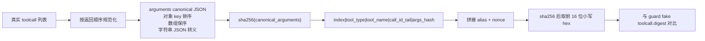

### 为什么只改参数也能拦截

攻击者如果只替换命令内容，例如：

```json
{
  "name": "shell_command",
  "arguments": "{\"command\":\"恶意命令\",\"workdir\":\"D:\\\\repo\"}"
}
```

即使工具名、call_id、参数字段名都没有变化，`canonical_arguments` 的 hash 也会变化，最终 digest 不一致，因此会被判定为 `guard_digest_mismatch`。

## 9. 字符串保护

字符串保护用于解决“读取配置文件或 JSON 中密钥字段后，敏感字符串被上游模型看到”的问题。

### 字符串保护链路

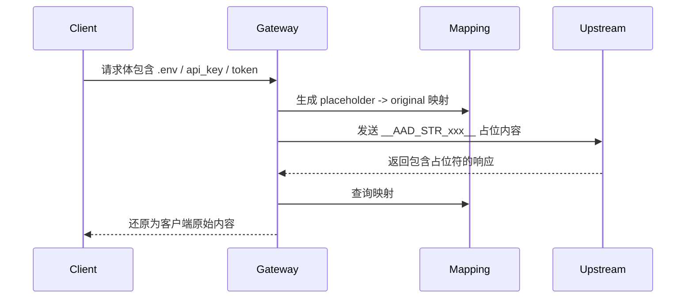

### 默认保护规则类型

| 规则类型 | 示例 | 处理方式 |
|---|---|---|
| JSON 密钥字段 | `api_key`, `secret`, `token`, `authorization`, `password` | 命中 key 后保护对应 value |
| 点号配置文件 | `.env`, `.npmrc`, `.pypirc`, `.netrc`, `.gitconfig` | 命中文本后替换为占位符 |
| 配置文件路径 | `config.json`, `settings.json` 等 | 根据规则替换敏感路径或字符串 |
| 密钥样式字符串 | Bearer token、长 token、私钥片段等 | 正则命中后替换 |

### 字符串保护流水

每次替换/还原都会写入操作记录：

| 字段 | 含义 |
|---|---|
| time | 操作时间 |
| stage | protect / restore / blocked |
| channel | openai / claude |
| route | chat / responses / messages |
| rule | 命中的规则说明 |
| path | JSON path 或文本位置 |
| before | 替换前摘要，不写明文密钥 |
| after | 占位符或还原说明 |
| count | 操作数量 |
| blocked | 是否为阻断记录 |

## 10. 阻断语义

防投毒阻断不是普通上游失败。

普通上游失败可以 fallback；防投毒失败必须硬终止。

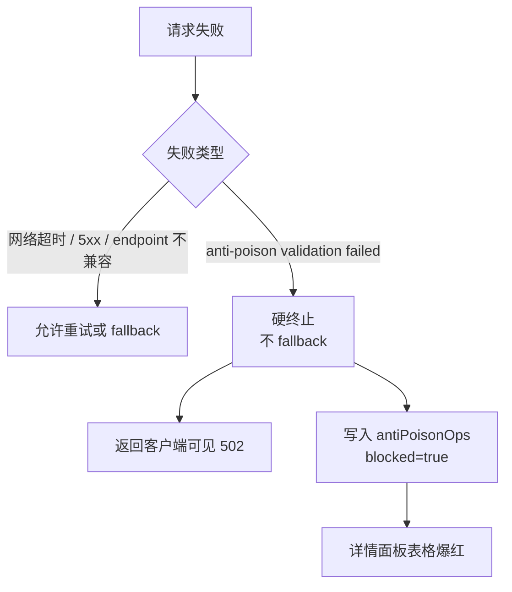

阻断原因：

| reason | 含义 |
|---|---|
| `missing_guard_toolcall` | 存在真实 toolcall，但缺少合法 guard fake toolcall |
| `guard_digest_mismatch` | guard fake toolcall 存在，但 digest 与真实调用链不一致 |
| `invalid stripped anti-poison response` | strip guard 后响应无法解析 |
| `invalid restored anti-poison response` | 还原字符串后响应无法解析 |

## 11. 配置说明

### AntiPoisonConfig

| 字段 | 说明 |
|---|---|
| `enabled` | 总开关。关闭后不显示红叉，也不启用策略 |
| `strictMode` | 严格模式。真实 toolcall 缺 guard 时直接拒绝 |
| `failureMode` | `block` 阻断，`warn` 只告警 |
| `strategyPrompt` | 策略 Prompt，可在面板编辑 |
| `algorithmPrompt` | 随机变化算法 Prompt，可在面板编辑 |
| `randomization` | 随机策略数量、句式变体、插入点等 |
| `stringProtection` | 字符串保护开关和规则列表 |

### Randomization

| 字段 | 默认意图 |
|---|---|
| `enabled` | 启用随机策略 |
| `strategyPoolSize` | 策略池大小，默认 10 |
| `minPhraseVariantsPerStrategy` | 每个策略至少 5 种句式变体 |
| `randomInsertionPoints` | 随机选择插入点 |
| `minFakeToolcalls` | 至少需要的 guard fake toolcall 数量 |
| `requirePerToolTypeMarker` | 要求覆盖工具类型标记 |

### StringProtection

| 字段 | 说明 |
|---|---|
| `enabled` | 是否启用字符串保护 |
| `rules` | 一行一个规则描述，冒号后为正则或 scope 规则 |

## 12. UI 面板

防投毒详情面板包含：

| 区域 | 功能 |
|---|---|
| 顶部状态 | 显示防投毒已开启/未开启 |
| 设置 | 开关、严格模式、失败处理方式、字符串保护 |
| 字符串保护规则 | 展开/编辑/重置规则 |
| 策略 Prompt | 编辑 guard fake toolcall 策略 |
| 随机变化算法 Prompt | 编辑 digest/chain/cover 生成说明 |
| 随机化可视 | 展示策略池、句式变体、随机插入点 |
| 流水统计 | 表格显示 request out / respond in 操作记录 |

### UI 操作结构图

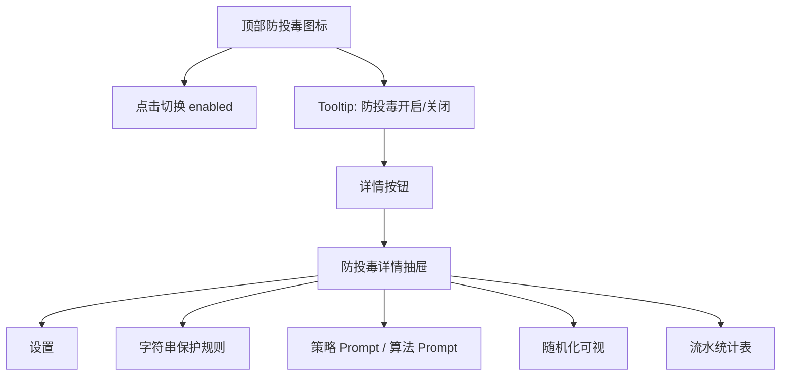

## 13. 日志和统计

### 日志位置

详细日志写入：

```text
advanced-proxy.log
```

常见日志标签：

| 日志标签 | 含义 |
|---|---|
| `[ANTI_POISON_PROMPT_APPLY]` | 已注入防投毒 Prompt 和 guard schema |
| `[ANTI_POISON_STRING_PROTECT]` | 已执行字符串保护 |
| `[ANTI_POISON_VALIDATE]` | 已执行响应校验 |
| `[ANTI_POISON_STRING_RESTORE]` | 已执行字符串还原 |
| `[ANTI_POISON_STREAM_BYPASS]` | 流式请求暂不做完整校验 |
| `[CLAUDE_PROXY_CHAT_SYSTEM_RECTIFY]` | Claude 兼容上游拒绝 system 时已做兼容修正 |

### 统计表字段

| 列 | 说明 |
|---|---|
| 时间 | 操作发生时间 |
| 阶段 | protect / restore / blocked 等 |
| 通路 | request out / respond in 对应的 openai / claude |
| 规则/逻辑 | 命中的规则或阻断原因 |
| 路径 | JSON path 或 route |
| before | 操作前摘要 |
| after | 操作后占位符或说明 |
| 数量 | 操作数量 |

## 14. 测试结论

测试报告见 `anti-poison-result.md`。

### 测试覆盖摘要

| 测试项 | 覆盖内容 | 结果 |
|---|---|---|
| 本地单元测试 | nonce/hash、guard toolcall 校验、字符串保护规则、还原逻辑 | 通过 |
| 本地 E2E 矩阵 | 5 种协议形态 x 5 类投毒注入场景 | 通过 |
| 阻断链路测试 | 检测到投毒后不 fallback 到其他 provider | 通过 |
| UI 构建 | 防投毒面板、统计表、规则配置、blocked 高亮 | 通过 |
| Live soak: OpenAI Responses | `gpt-5.5`，30 分钟 | 50/50 成功 |
| Live soak: Claude Messages | `claude-sonnet-4-6`，30 分钟 | 56/56 成功 |

### 攻击样本覆盖

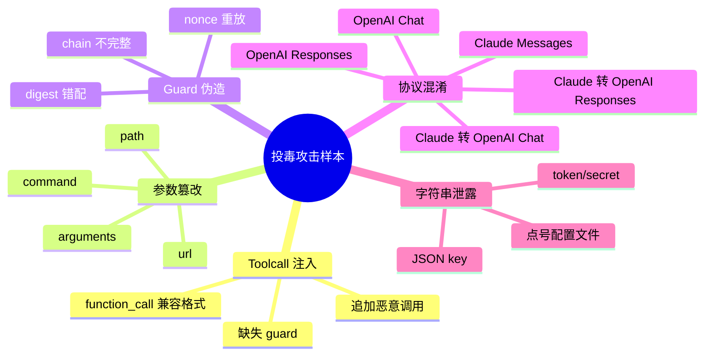

## 15. 兼容性说明

### OpenAI Responses

防投毒 Prompt 写入 `instructions`，guard fake tool 写入 `tools`。响应中按 `output[].type=function_call` 提取真实 toolcall 和 guard fake toolcall。

### OpenAI Chat

防投毒 Prompt 作为 system message 前置，guard fake tool 写入 `tools[].function`。响应中按 `choices[].message.tool_calls` 和兼容 `function_call` 提取。

### Claude Messages

防投毒 Prompt 写入 `system`，guard fake tool 写入 Anthropic tools。响应中按 `content[].type=tool_use` 提取。

### Claude 兼容 OpenAI Chat

部分中转对 Claude 模型不接受 OpenAI Chat 的 `system` role，会返回类似 `claude system prompt not allowed`。网关会进行一次兼容修正，把 system 指令合并进首条 user 内容，保留防投毒语义后重试。

### 协议偏好隔离

Claude 的协议偏好 scope 额外包含 `claude_api_format`，避免同一站点、同一 key、同一模型下，`openai_responses` 的偏好污染 `openai_chat` 配置。

## 16. 运维建议

1. 生产环境建议保持 `enabled=true`、`strictMode=true`、`failureMode=block`。
2. 如果调试误报，可以临时切换 `failureMode=warn`，但不建议长期使用。
3. 修改策略 Prompt 或算法 Prompt 后，应至少跑本地 E2E 防投毒矩阵。
4. 字符串保护规则建议优先覆盖点号配置文件、JSON 密钥字段和长 token。
5. 发现 blocked 记录时，先查看详情面板流水，再查 `advanced-proxy.log`。
6. 流式请求当前只记录绕过日志，涉及高风险工具调用时建议使用非流式链路。

## 17. 常见问题

### 为什么不能只改工具名 alias？

只改工具名无法防止攻击者识别常见参数结构，例如 `command`、`workdir`、`path`。本方案校验的是完整真实 toolcall 链路，尤其包含 canonical arguments 的 hash，因此参数被改也会被发现。

### 为什么 nonce 不是工具？

nonce 是每轮请求生成的随机种子，不是工具。它用于绑定本轮 Prompt、guard fake toolcall 和 digest，防止攻击者重放旧 guard。

### 为什么 guard fake toolcall 要让模型生成？

因为攻击发生在模型输出链路上，模型若产生真实 toolcall，就必须同时输出一份可被网关验证的链路摘要。网关重新计算 digest，最终裁判权仍在本地。

### 如果攻击者也能读到 Prompt 呢？

非定向大规模投毒很难实时解析每轮随机 Prompt、nonce、算法别名和 digest 规则。定向攻击仍可能尝试适配，因此最终必须依赖网关校验，而不是依赖 Prompt 自身。

### 为什么字符串保护还要还原？

占位是为了避免敏感字符串进入上游模型上下文；还原是为了客户端语义不丢失。映射只保存在本轮网关上下文内，respond in 阶段统一替换回客户端可理解的内容。

## 18. 设计边界

| 边界 | 说明 |
|---|---|
| 模型本身恶意 | 无法通过 Prompt 或 guard 完全解决 |
| 流式请求 | 已支持增量 toolcall 聚合校验与 guard 剥离；当前未覆盖 Realtime WebSocket 双向协议 |
| 超复杂定向攻击 | 如果攻击者实时拿到上下文并用大模型辅助生成合法 guard，难度升高但不能视为数学不可破 |
| 网关绕过 | 请求不经过 Advanced Proxy 时本方案不生效 |
| 业务级授权 | 防投毒只判断链路是否被污染，不替代用户授权和权限管理 |
