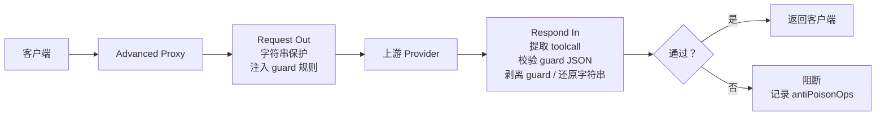

# AllApiDeck 防投毒说明

本文档只描述当前实现，不保留旧版投毒演练流水和过期规则。

## 当前目标

防投毒运行在 Advanced Proxy 网关层，目标是阻断“响应里夹带真实工具调用”的链路污染，并在请求发往上游前隐藏明确的敏感字符串。

核心边界：

| 能处理 | 不处理 |
|---|---|
| 上游响应插入、追加、伪造真实 toolcall | 绕过 Advanced Proxy 的请求 |
| toolcall 前缺少合法 guard JSON | 客户端已经执行完成的外部副作用 |
| guard JSON 与紧随其后的真实工具名不匹配 | 模型本身完全恶意且客户端不经过网关 |
| request out 中的密钥值、密钥形态文本、敏感工具结果、用户 `<...>` 主动标记内容 | 普通 `.env`、`settings.json` 这类文件名 mention |

## 请求链路



## Guard 机制

当前实现使用文本 guard JSON，并只校验最小绑定字段。

当模型准备输出真实 toolcall 时，必须在该 toolcall 前输出一个文本块：

```text
<aad_guard_json>{"name":"aad_guard_<随机前缀>_<真实工具名>","tool_name":"真实工具名"}</aad_guard_json>
```

网关校验规则：

| 项目 | 要求 |
|---|---|
| 位置 | guard JSON 必须出现在对应真实 toolcall 前 |
| 字段 | 只需要 `name` 和 `tool_name` |
| `name` | 必须符合本轮随机 guard 前缀和真实工具名绑定规则 |
| `tool_name` | 必须等于紧随其后的真实工具名 |
| 数量 | 每个真实 toolcall 至少有一个可匹配 guard JSON |

通过后，网关会在回客户端前剥离 guard JSON，用户不会看到内部校验文本。缺失或不匹配时，记录 `missing_guard_toolcall` 或 `guard_coverage_mismatch`，并按配置阻断或告警。

## 字符串保护

字符串保护用于在 request out 阶段把敏感内容替换为 `__AAD_STR_...__` 占位符，并在 respond in 阶段还原。

默认保护范围：

| 类型 | 例子 | 说明 |
|---|---|---|
| JSON 字段值 | `api_key`, `secret`, `token`, `password`, `authorization` | key 命中后保护对应 value |
| 密钥形态文本 | Bearer token、长 token、环境变量式密钥、私钥块 | text 正则命中后保护 |
| 敏感工具结果 | `.env` 文件内容、密钥配置内容、私钥块 | 只有像真实敏感内容时整体保护 |
| 用户主动标记 | `<passw0rd>`、`<my-token>` | `user_text:` 只作用于用户输入文本 |

默认不保护普通文件名 mention。比如用户或工具说明里只出现 `.env`、`settings.json`、`.claude/settings.json`，不会因为文件名本身被替换。真正需要保护的是文件内容里的 token、密钥和值。

规则格式是一行一个：

```text
描述: scope:正则
```

支持的 scope：

| scope | 含义 |
|---|---|
| `key:` | 匹配 JSON 字段名，保护该字段值 |
| `path:` | 匹配 JSON path，保护该 path 下的值 |
| `text:` | 匹配任意文本值 |
| `user_text:` | 只匹配用户输入文本，默认保护用户主动标记 `<...>` 括号内机密内容 |

## 记录和详情

防投毒流水写入请求详情的 `antiPoisonOps`。

| 字段 | 含义 |
|---|---|
| `stage` | `request out`、`respond in` 或阻断阶段 |
| `rule` | 命中的规则或阻断原因 |
| `path` | 命中的 JSON path |
| `before` | request out 显示原始内容，respond in 显示占位符 |
| `after` | request out 显示占位符，respond in 显示还原后的原文 |
| `context` | 命中位置周边 payload 上下文 |
| `blocked` | 是否阻断 |
| `reason` | 阻断或跳过原因 |

## 配置项

| 配置 | 作用 |
|---|---|
| `enabled` | 防投毒总开关 |
| `strictMode` | 严格校验真实 toolcall 是否有 guard |
| `failureMode` | `block` 阻断或 `warn` 只告警 |
| `strategyPrompt` | 注入给模型的 guard 行为约束 |
| `algorithmPrompt` | 注入给模型的最小 guard JSON 生成说明 |
| `stringProtection.enabled` | 字符串保护开关 |
| `stringProtection.rules` | 可编辑正则规则列表 |

## 当前验证

主要覆盖：

| 测试 | 覆盖 |
|---|---|
| Guard prompt 单测 | 最小 guard JSON 规则、失败提示、过期文案清理 |
| Toolcall 校验单测 | 缺 guard、guard 与真实工具不匹配、guard 剥离 |
| 字符串保护单测 | JSON key value、token、敏感工具结果、用户 `<...>` 标记、普通文件名 mention 不保护 |
| 流式处理单测 | split guard JSON 剥离、流式 toolcall 观察 |
| 桌面构建 | Vue 面板、配置桥接、Go/Wails 打包 |

## 运维建议

1. 默认建议 `enabled=true`、`strictMode=true`、`failureMode=block`。
2. 字符串保护优先保护真实密钥值和用户主动 `<...>` 标记，不要把普通文件名 mention 当敏感内容。
3. 修改规则后，查看请求详情里的 `before`、`after`、`context`，确认保护的是目标内容。
4. 出现阻断时，先看 `reason` 和工具调用归类，再决定是规则误报还是上游响应污染。
