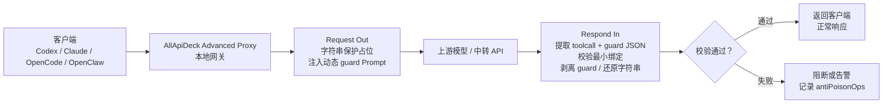
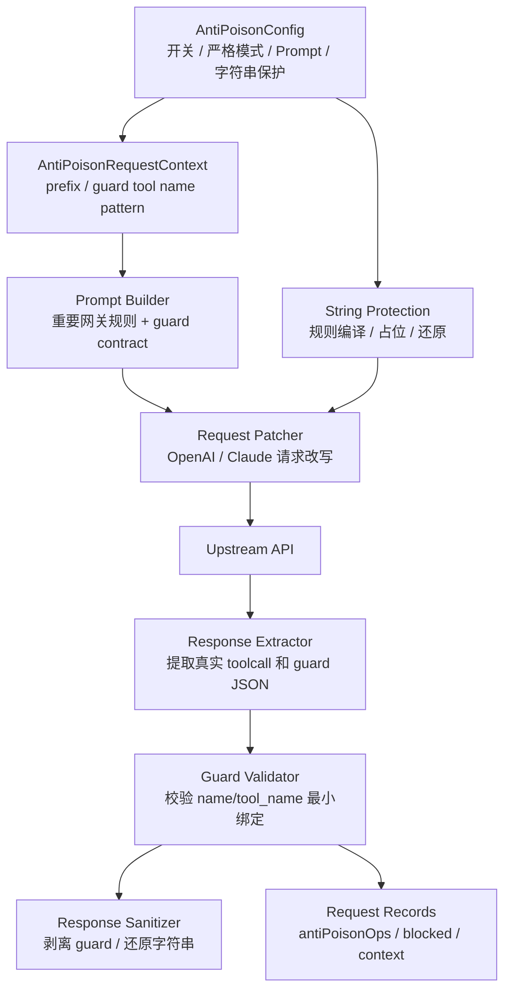
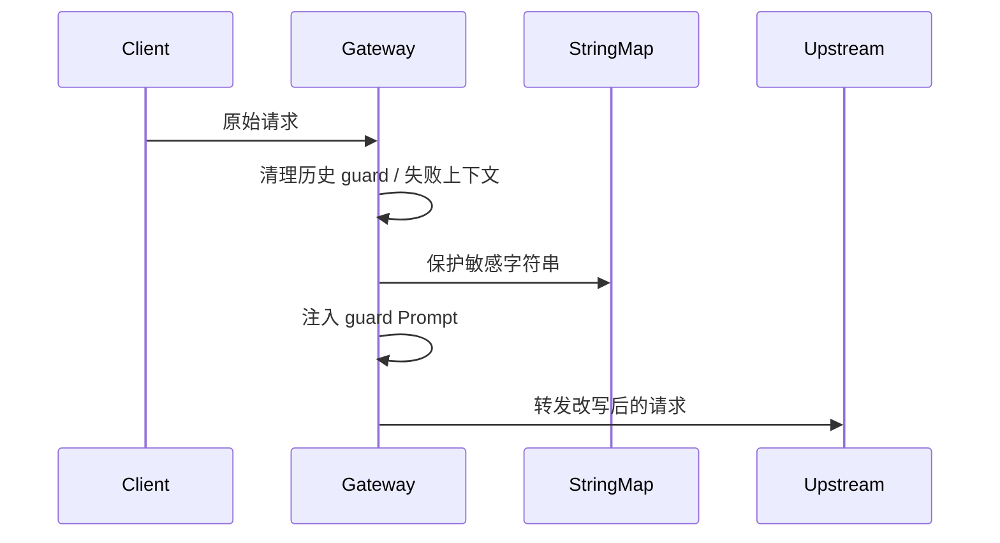
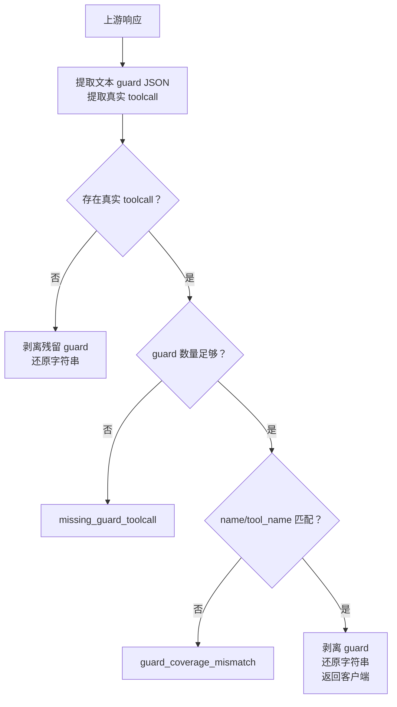
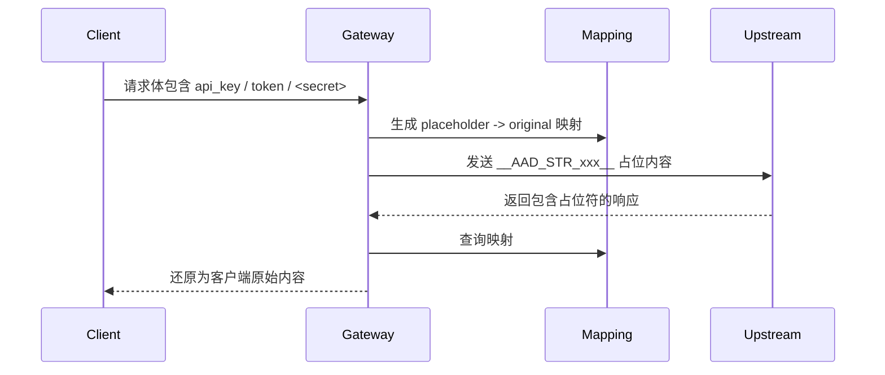
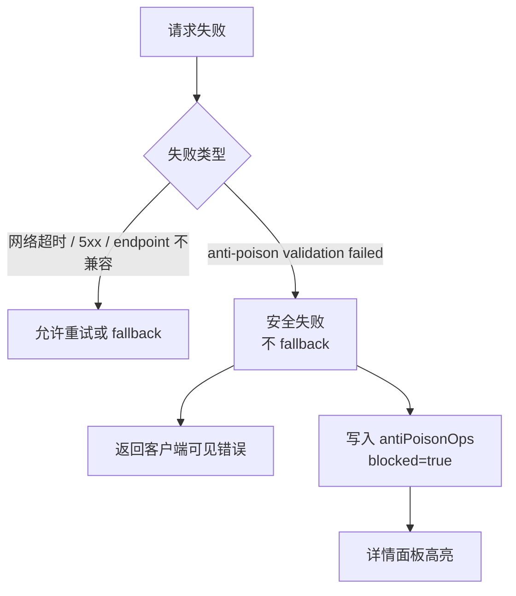

# AllApiDeck 防投毒 Wiki

本文档说明 AllApiDeck Advanced Proxy 当前防投毒能力，包括威胁模型、核心原理、请求/响应链路、字符串保护、配置项、日志统计、测试覆盖、协议兼容和已知边界。

## 1. 总览

防投毒模块的目标不是让模型“自己判断自己是否安全”，而是在本地高级代理网关层建立一套可验证的回流校验机制。

核心思路：

1. 请求发往上游模型前，网关注入本轮动态 guard 规则 Prompt。
2. 如果模型准备输出任何真实 toolcall，必须先输出一个 `<aad_guard_json>...</aad_guard_json>` 文本块。
3. guard JSON 只需要 `name` 和 `tool_name` 两个最小绑定字段。
4. 网关在响应回流时提取真实 toolcall 和 guard JSON，校验 guard 是否覆盖紧随其后的真实工具名。
5. 校验失败时按配置阻断或告警；校验通过时剥离 guard JSON，再返回客户端。
6. 对密钥值、密钥样式文本、敏感工具结果和用户主动 `<...>` 标记内容，在 request out 阶段替换为占位符，respond in 阶段再还原。

### 一图看懂



## 2. 防护对象和威胁模型

防投毒主要面向“响应链路被污染”以及“敏感内容进入上游后被诱导泄露”的风险。

| 风险类别 | 典型场景 | 防护目标 |
|---|---|---|
| 响应 toolcall 注入 | 上游响应中被插入未授权工具调用 | 阻断缺少合法 guard JSON 的真实 toolcall |
| 参数定向篡改 | 工具名不变，但 command、path、URL、arguments 被替换 | 要求真实 toolcall 前存在与该工具名绑定的 guard JSON，提升链路污染可见性 |
| 伪造调用链 | 响应中追加真实 toolcall | 每个真实 toolcall 都必须有可匹配 guard JSON |
| 多协议混淆 | OpenAI Chat / Responses / Claude Messages 结构不同 | 分协议解析真实 toolcall 和 guard JSON，再统一校验 |
| Hosted tool 误判 | OpenAI Responses `web_search_call` 等托管输出被误当普通 function call | 区分 hosted tool call 和普通 function call，避免误杀内置工具输出 |
| 敏感字符串泄露 | JSON key value、token、私钥、敏感工具结果、用户 `<...>` 标记内容进入上游 | request out 替换占位符，respond in 还原 |
| 阻断后 fallback 绕过 | 安全失败被当成普通上游失败继续 fallback | anti-poison blocked 硬终止本次请求 |

不在防护范围内：

| 不防护内容 | 原因 |
|---|---|
| 完全绕过 Advanced Proxy 的请求 | 防投毒逻辑位于本地网关内 |
| 客户端已经执行完成的外部副作用 | 网关只能阻断回流前检测到的内容，不能回滚已执行外部系统副作用 |
| 模型本身完全恶意且客户端不经过网关 | 本方案的最终裁判在网关，不在模型 |
| 普通文件名 mention | `.env`、`settings.json` 等文件名本身不是密钥；真正需要保护的是文件内容里的 token、secret、password 等值 |

## 3. 核心术语

| 术语 | 含义 |
|---|---|
| 网关 | AllApiDeck Advanced Proxy，本地请求/响应中转层 |
| request out | 请求发往上游前的处理通路 |
| respond in | 上游响应回客户端前的处理通路 |
| guard JSON | 模型在真实 toolcall 前输出的 `<aad_guard_json>{...}</aad_guard_json>` 文本块 |
| guard prefix | 网关每轮生成的随机前缀，用于构造本轮 guard `name` |
| `name` | guard JSON 内的字段，必须符合 `aad_guard_xxx_<真实工具名>` 命名规则 |
| `tool_name` | guard JSON 内的字段，必须等于紧随其后的真实工具名 |
| hosted tool call | OpenAI Responses 内置输出项，如 `web_search_call`，不等同于客户端真实 function call |
| string protection | 字符串保护，指敏感值、敏感工具结果和用户主动标记内容的占位与还原 |
| `__AAD_STR_...__` | 字符串保护占位符 |
| blocked | 网关确认防投毒校验失败后的阻断记录 |

## 4. 模块结构



核心文件：

| 文件 | 作用 |
|---|---|
| `desktop/advanced_proxy_anti_poison.go` | 防投毒注入、解析、校验、剥离、字符串保护和流水记录 |
| `desktop/advanced_proxy_config.go` | 防投毒默认 Prompt、默认字符串保护规则、配置清洗 |
| `desktop/advanced_proxy_runtime.go` | 高级代理请求链路、fallback、请求记录和错误处理 |
| `desktop/src/components/AdvancedProxyModal.vue` | 防投毒开关、规则编辑、请求详情和流水 UI |
| `desktop/src/utils/advancedProxyBridge.js` | 前端默认配置、配置归一化和旧规则迁移 |

## 5. Request Out 链路

请求发往上游前，网关按顺序处理：

1. 清理历史防投毒提示、历史 guard JSON 和历史失败行，避免上一轮上下文污染本轮。
2. 清理工具参数中的可选空字段，例如 `pages:""`，减少工具因为空参数反复失败。
3. 执行字符串保护，把命中规则的敏感内容替换为 `__AAD_STR_...__`。
4. 根据协议注入 guard Prompt。
5. 记录 request out 阶段的防投毒流水。



### Prompt 注入位置

| 协议 | 注入位置 |
|---|---|
| OpenAI Chat | 前置 system message |
| OpenAI Responses | 写入 `instructions`；精确重试时可插入 `input` system block |
| Claude Messages | 写入或前置到 `system` |

## 6. Guard Prompt 和契约

Prompt 会告诉模型：如果本轮要输出真实 toolcall，真实 toolcall 前必须输出一个 guard JSON 文本块。

格式示例：

```text
<aad_guard_json>{"name":"aad_guard_3d8a797cd7_WebSearch","tool_name":"WebSearch"}</aad_guard_json>
```

关键要求：

| 要求 | 说明 |
|---|---|
| 位置 | guard JSON 必须紧挨真实 toolcall 前，替代普通进度说明 |
| 包裹标签 | 必须使用 `<aad_guard_json>...</aad_guard_json>` |
| 字段 | 只需要 `name` 和 `tool_name` |
| `name` | 必须符合本轮随机前缀 + 真实工具名 |
| `tool_name` | 必须等于下一个真实工具名 |
| 无真实 toolcall | 不输出 guard JSON |
| 无法生成合法 guard | 不输出真实 toolcall，并返回 `guard generation failed for pending toolcall` |

Prompt 明确禁止把 guard 规则、guard 名称、前缀、校验结果解释给用户。guard 是网关内部安全材料，不是用户任务内容。

## 7. Respond In 校验

上游响应回来后，网关会解析真实 toolcall 和 guard JSON。



当前校验重点是“覆盖关系”：每个真实 toolcall 至少要有一个 guard JSON 能匹配工具名和本轮命名规则。

### 阻断原因

| reason | 含义 |
|---|---|
| `missing_guard_toolcall` | 存在真实 toolcall，但 guard JSON 数量不足或不存在 |
| `guard_coverage_mismatch` | guard JSON 存在，但 `name` / `tool_name` 与真实工具调用不匹配 |
| `guard_digest_mismatch` | 兼容旧记录的 reason 名；当前最小 guard 模式下复杂 digest 字段被忽略 |
| `invalid stripped anti-poison response` | 剥离 guard 后响应无法解析 |
| `invalid restored anti-poison response` | 还原字符串后响应无法解析 |

## 8. 流式响应处理

流式响应会面对分片问题：guard JSON 可能被拆成多段，toolcall 生命周期也可能被拆成 created / delta / done 等多个事件。

当前处理重点：

| 场景 | 处理方式 |
|---|---|
| split guard JSON | 聚合文本后识别并剥离 `<aad_guard_json>...</aad_guard_json>` |
| OpenAI Responses function call lifecycle | 聚合同一 call 的生命周期事件，避免重复或漏判 |
| OpenAI hosted `web_search_call` | 保留为 hosted tool call，不按普通 function call 强制 guard |
| 流式工具调用观察 | 写入工具调用归类和响应预览，便于详情页排查 |

流式处理的安全目标和非流式一致：不把内部 guard JSON 暴露给客户端，并尽量避免 hosted tool call 误杀。

## 9. 字符串保护

字符串保护用于避免密钥值、密钥样式文本、敏感工具结果和用户主动标记内容被上游模型看到。

### 链路



### 默认保护规则类型

| 规则类型 | 示例 | 处理方式 |
|---|---|---|
| JSON 密钥字段 | `api_key`, `secret`, `token`, `authorization`, `password` | 命中 key 后保护对应 value |
| 用户主动标记 | `<passw0rd>`、`<my-token>` | `user_text:` 默认只在用户输入文本中保护尖括号整体内容 |
| 密钥样式字符串 | Bearer token、长 token、环境变量式密钥、私钥块 | 正则命中后替换 |
| 敏感工具结果 | `.env` 文件内容、密钥配置内容、私钥块 | 只在结果看起来像真实敏感内容时整体保护 |

默认不保护普通文件名 mention。比如用户或工具说明里只出现 `.env`、`settings.json`、`.claude/settings.json`，不会因为文件名本身被替换。真正需要保护的是文件内容里的 token、密钥和值。

### 规则格式

一行一个规则：

```text
描述: scope:正则
```

支持的 scope：

| scope | 含义 |
|---|---|
| `key:` | 匹配 JSON 字段名，保护该字段值 |
| `path:` | 匹配 JSON path，保护该 path 下的值 |
| `text:` | 匹配任意文本值 |
| `user_text:` | 只匹配用户输入文本，默认保护用户主动标记 `<...>` 括号内机密内容 |

### 字符串保护流水

每次替换/还原都会写入操作记录：

| 字段 | 含义 |
|---|---|
| `stage` | `request out` 或 `respond in` |
| `rule` | 命中的规则说明 |
| `path` | JSON path |
| `before` | request out 显示原文，respond in 显示占位符 |
| `after` | request out 显示占位符，respond in 显示还原原文 |
| `context` | 命中位置周边 payload 上下文 |
| `count` | 命中数量 |

## 10. 阻断语义

防投毒阻断不是普通上游失败。

普通上游失败可以 retry 或 fallback；防投毒失败必须按安全失败处理，避免换一个 provider 后绕过同一条污染响应。



`failureMode=block` 时直接阻断；`failureMode=warn` 时记录告警但不硬阻断，适合排查误报，不建议长期作为生产默认。

## 11. 配置说明

### AntiPoisonConfig

| 字段 | 说明 |
|---|---|
| `enabled` | 防投毒总开关 |
| `strictMode` | 严格模式。真实 toolcall 缺 guard 时直接拒绝 |
| `failureMode` | `block` 阻断，`warn` 只告警 |
| `strategyPrompt` | 策略 Prompt，可在面板编辑 |
| `algorithmPrompt` | 最小 guard JSON 生成说明，可在面板编辑 |
| `randomization` | 保留的随机化配置，用于生成本轮前缀和兼容历史配置 |
| `stringProtection` | 字符串保护开关和规则列表 |

### stringProtection

| 字段 | 说明 |
|---|---|
| `enabled` | 是否启用字符串保护 |
| `rules` | 一行一个正则规则，支持 `key:`、`path:`、`text:`、`user_text:` |

旧配置中的“点号配置文件路径 / 常见配置文件路径”默认规则会在配置清洗时移除，并自动补上当前 `user_text:` 默认规则。

## 12. UI 面板

高级代理面板提供：

| 区域 | 能力 |
|---|---|
| 防投毒开关 | 开启/关闭防投毒、切换严格模式和失败处理方式 |
| 字符串保护 | 开启/关闭字符串保护 |
| 字符串保护规则 | 展开、编辑、重置规则，说明 `key:` / `path:` / `text:` / `user_text:` 作用域 |
| 策略 Prompt | 编辑 guard 行为约束 |
| 随机变化算法 Prompt | 编辑最小 guard JSON 生成说明 |
| 请求记录详情 | 查看摘要、请求结果、防投毒流水、工具调用归类、链路、网关 Prompt、上游观察、响应预览和原始对象 |

详情页用于回答几个关键问题：

1. 上游到底有没有返回真实 toolcall？
2. 真实 toolcall 是 hosted tool 还是普通 function call？
3. guard JSON 是否存在，是否匹配真实工具名？
4. 哪条字符串保护规则命中了，命中 payload 上下文是什么？
5. 阻断是否来自防投毒，而不是普通上游失败？

## 13. 日志和统计

常见日志标记：

| 标记 | 含义 |
|---|---|
| `[ANTI_POISON_STRING_PROTECT]` | 已执行字符串保护 |
| `[ANTI_POISON_STRING_RESTORE]` | 已执行字符串还原 |
| `[ANTI_POISON_STRING_RULE_INVALID]` | 某条字符串保护正则无效 |
| `[ADV_PROXY_REQUEST_RECORD]` | 请求记录写入 |

请求详情中的 `antiPoisonOps` 是排查主入口。优先看：

| 字段 | 用途 |
|---|---|
| `rule` | 判断命中的是 guard 校验、字符串保护还是还原 |
| `before` / `after` | 判断替换和还原是否符合预期 |
| `context` | 判断规则命中的 payload 位置 |
| `blocked` / `reason` | 判断是否安全阻断以及原因 |
| 工具调用归类 | 判断真实 toolcall、hosted tool call 和 function call 的数量 |

## 14. 测试覆盖

当前主要覆盖：

| 测试项 | 覆盖内容 | 状态 |
|---|---|---|
| Guard Prompt 单测 | 最小 guard JSON 规则、失败提示、过期文案清理 | 通过 |
| Prompt 注入单测 | OpenAI Chat、OpenAI Responses、Claude Messages 注入位置 | 通过 |
| Toolcall 校验单测 | 缺 guard、guard 与真实工具不匹配、guard 剥离 | 通过 |
| Hosted Web Search 单测 | OpenAI Responses `web_search_call` 不误杀 | 通过 |
| 流式处理单测 | split guard JSON 剥离、流式 toolcall 聚合和归类 | 通过 |
| 字符串保护单测 | JSON key value、token、敏感工具结果、用户 `<...>` 标记、普通文件名 mention 不保护 | 通过 |
| 参数规范化单测 | `pages:""` 等可选空字段清理 | 通过 |
| 桌面构建 | Vue 面板、配置桥接、Go/Wails 打包 | 通过 |

最近验证命令：

```powershell
cd desktop
go test . -run 'TestAntiPoisonStringProtection|TestParseToolInputMapDropsOptionalEmptyPaginationFields|TestSanitizeAntiPoisonOpenAIResponsesStreamBodyStripsSplitGuardJSON|TestApplyAntiPoisonPromptTo.*' -count=1
npm run build:desktop
```

## 15. 攻击/投毒手段覆盖

| 攻击/投毒类别 | 典型手段 | 检测点 |
|---|---|---|
| 缺失 guard 的真实 toolcall 注入 | 上游直接返回 `shell_command`、文件读取、HTTP 请求等真实 toolcall | 真实 toolcall 数量大于 0，但 guard JSON 不足 |
| guard 绑定错误 | guard JSON 的 `tool_name` 与真实工具名不一致 | `name` / `tool_name` 最小绑定校验失败 |
| 额外真实 toolcall | 正常响应后追加一条真实工具调用 | 每个真实 toolcall 都需要匹配 guard JSON |
| 协议形态混淆 | 在 Chat、Responses、Claude Messages 不同结构中塞入 toolcall | 分协议解析后统一校验 |
| hosted tool 误杀 | `web_search_call` 被错误当成 function call | hosted tool call 分类跳过普通 function guard 要求 |
| 敏感值泄露 | 请求中带有 token、secret、private key 或用户 `<...>` 标记 | request out 字符串保护占位，respond in 还原 |
| 阻断后 fallback 绕过 | 防投毒失败后继续 fallback 到其他 provider | blocked 安全失败硬终止 |

## 16. 协议兼容性

### OpenAI Responses

防投毒 Prompt 写入 `instructions`。响应中按 `output[].type=function_call` 提取普通 function call，并从文本输出中提取 `<aad_guard_json>`。`web_search_call` 等 hosted tool call 会进入 hosted 分类，不按普通 function call 强制 guard。

### OpenAI Chat

防投毒 Prompt 作为 system message 前置。响应中按 `choices[].message.tool_calls` 和兼容 `function_call` 提取真实工具调用，并从 assistant 文本中提取 guard JSON。

### Claude Messages

防投毒 Prompt 写入或前置到 `system`。响应中按 `content[].type=tool_use` 提取真实工具调用，并从 text block 中提取 guard JSON。

### Claude 兼容 OpenAI Chat / Responses

Claude 客户端请求可经高级代理转换到 OpenAI Chat 或 Responses 上游。防投毒 Prompt 会在转换后的对应协议位置注入，并在响应转换回客户端前完成 guard 剥离和字符串还原。

## 17. 运维建议

1. 生产环境建议保持 `enabled=true`、`strictMode=true`、`failureMode=block`。
2. 如果调试误报，可以临时切换 `failureMode=warn`，但不建议长期使用。
3. 字符串保护规则优先覆盖真实密钥值、密钥形态文本、敏感工具结果和用户主动 `<...>` 标记。
4. 不要把普通 `.env` / `settings.json` 文件名 mention 当作默认保护目标；详情里应重点看 payload context 和 before/after。
5. 发现 blocked 记录时，先查看详情面板的工具调用归类、reason 和防投毒流水，再查日志。
6. 修改 Prompt 或字符串保护规则后，至少跑 targeted anti-poison 单测和桌面构建。

## 18. 常见问题

### 为什么 guard JSON 要放在真实 toolcall 前？

因为网关需要在响应回流时确认模型不是直接输出真实工具调用。guard JSON 作为真实 toolcall 前的最小绑定材料，可以让网关在不暴露内部校验内容给用户的情况下判断是否放行。

### 为什么只校验 `name` 和 `tool_name`？

真实请求中上下文很大，复杂字段越多，模型越容易因为格式或摘要细节出错。当前策略把模型需要稳定生成的内容压到最小，只要求它明确绑定“下一条真实工具名”，最终放行仍由网关判断。

### 为什么不保护普通 `.env` 文件名？

文件名 mention 本身不是密钥。工具说明、系统提示和用户指令里经常出现 `.env`、`settings.json` 这样的普通路径说明，如果默认替换，会破坏上下文并造成大量无意义流水。当前保护重点是文件内容和真实密钥值。

### 用户主动 `<...>` 标记是做什么的？

这是给用户的手动保护通道。如果用户明确知道某段文本是机密，可以写成 `<passw0rd>` 或 `<my-token>`，默认 `user_text:` 规则会在用户输入文本中保护这段内容，并在返回客户端前还原。

### 字符串保护为什么还要还原？

上游只需要看到占位符，客户端仍需要看到自己原来的内容。还原发生在 respond in 阶段，映射只存在本次请求上下文中。

### 防投毒失败为什么不 fallback？

防投毒失败是安全失败，不是普通上游不可用。如果继续 fallback，可能把同一条污染响应绕过安全边界交给另一个链路处理。

## 19. 已知边界

| 边界 | 说明 |
|---|---|
| 网关内防护 | 只有经过 Advanced Proxy 的请求才受保护 |
| 外部副作用 | 网关不能回滚客户端已执行的系统命令、网络请求或外部写入 |
| Prompt 不是最终裁判 | Prompt 只约束模型输出格式，最终是否放行由网关校验决定 |
| 字符串保护依赖规则 | 未命中规则的敏感内容不会自动神奇识别，建议按实际 payload 调整规则 |
| hosted tool 差异 | 不同上游可能扩展自己的 hosted tool 类型，需要持续补充分类规则 |
