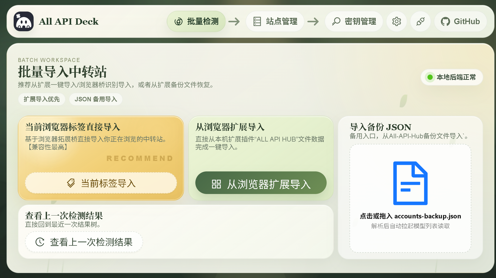
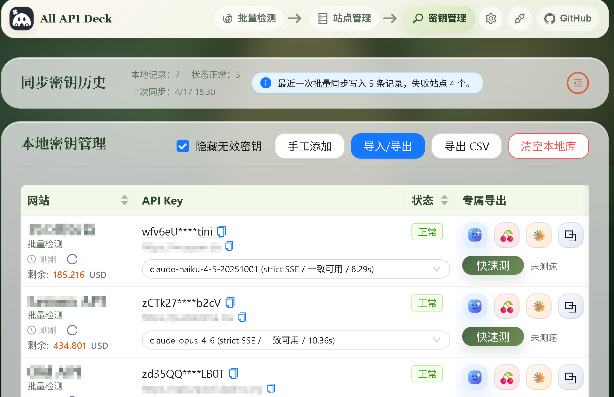
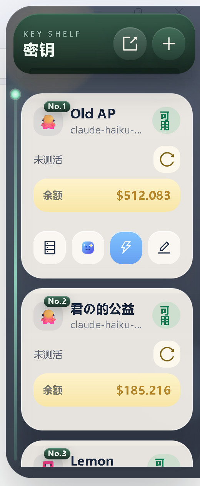

<div align="center">


**Desktop app for importing, scanning, testing, managing, and routing large batches of relay sites and API keys**

<p>
Supports portable account import, batch model discovery, quick checks, key grouping, one-click client takeover, and local advanced proxying for Claude, Codex, OpenCode, and OpenClaw.
</p>

<p align="center">
<a href="https://github.com/jlwebs/AllApiDeck/releases">
  
</a><!--
--><a href="https://github.com/jlwebs/AllApiDeck/stargazers">
  
</a><!--
--><a href="https://deepwiki.com/jlwebs/AllApiDeck">
  
</a><!--
--><a href="../../LICENSE">
  
</a><!--
--><!--
-->
</p>

<p align="center">
  <a href="../../README.md">中文</a> |
  <a href="./README.en.md"><strong>English</strong></a>
</p>

</div>

## What This Is

All API Deck is a desktop workflow for people handling large numbers of relay sites, API keys, and model combinations.

- Import existing site and key data from extensions, backups, and local directories
- Discover models and run quick checks across many sites
- Group, filter, and manage large key inventories in one place
- Hand selected records over to Claude, Codex, OpenCode, or OpenClaw
- Use a local advanced proxy when protocol compatibility needs a last-mile fix

## Current Capabilities

- Portable import from browser-extension bridge data, extension backups, and scanned directories
- Batch model discovery
- Batch availability checks with TTFT, TPS, latency, and protocol probing
- Key grouping, filtering, and side panel / floating window management
- One-click config generation and local writeback for Claude, Codex, OpenCode, and OpenClaw
- Advanced proxy with provider queues, failover, protocol fallback, request healing, and request records
- Editable `fetch(...)` replay for recent requests

## UI Preview





## Advanced Proxy Flow


## Core Features

### 1. Site / account import

Supported import paths:

- browser-extension bridge import
- ALL-API-HUB backup JSON import
- extension directory / local data directory scanning

### 2. Batch model discovery

Fetches model lists concurrently and keeps:

- success / failure state
- failure reason
- discovered model sets
- structured results for later filtering

### 3. Batch quick checks

Checks selected sites and models with:

- available / failed status
- status code and error reason
- TTFT / TPS / Latency
- protocol probing and fallback result
- request details for reproduction

### 4. Key management, side panel, and floating window

Supports:

- record grouping
- batch clipboard key import
- quick refresh and quick test
- model switching per record
- provider queue and live dispatch visibility
- dispatch observation and call-cluster organization

### 5. One-click desktop client takeover

Supported client targets:

- Claude
- Codex
- OpenCode
- OpenClaw

The app can generate a config preview from the selected record and write local client config files directly.

### 6. Advanced proxy

Supports:

- provider priority queues
- automatic failover
- `messages` / `responses` / `chat/completions` fallback
- protocol preference memory for host / key / model combinations
- request normalization and healing
- `invalid_encrypted_content` auto-healing
- request records and route tracing

### 7. Request records and debugging

The request records panel keeps:

- entry / exit route
- upstream URL
- fallback path
- status code
- timing metrics
- input / output token counts
- error summary

The latest 50 requests also keep full request bodies in memory and can be replayed through an editable `fetch(...)` command.

## Who This Is For

- users managing many relay sites, keys, and model combinations
- users migrating existing extension or backup data into a desktop workspace
- users doing repeated discovery, testing, filtering, and grouping
- users connecting Claude, Codex, OpenCode, or OpenClaw through a local compatibility layer

## Quick Start

### 1. Download the desktop build

Releases:

https://github.com/jlwebs/AllApiDeck/releases

Current release assets include:

- Windows: `allapideck-windows-amd64.exe`
- Windows: `allapideck-windows-amd64.msi`
- macOS: `allapideck-macos-universal.dmg`
- Linux: `allapideck-linux-amd64.tar.gz`
- Linux: `allapideck-linux-amd64.deb`
- Linux: `allapideck-linux-amd64.AppImage`

On Windows, auto-update prefers the `.msi` installer.

### 2. Import site records

Recommended first:

- browser-extension bridge import
- ALL-API-HUB backup JSON import

Common backup filenames:

- `accounts-backup.json`
- `accounts-backup-2026-04-01.json`

### 3. Discover models and run quick checks

Typical first steps:

1. fetch model lists in batch
2. run quick checks against target models

### 4. Enable advanced proxy takeover when needed

1. configure the provider queue
2. enable takeover for the target app
3. verify base URL, token, model, and protocol
4. write the local config

## Project Structure

```text
.
├─ desktop/                          Main desktop app directory
│  ├─ src/                           Vue frontend pages and components
│  ├─ wailsjs/                       Wails binding code
│  ├─ scripts/                       Dev, build, and packaging scripts
│  ├─ docs/                          Docs and screenshots
│  ├─ build/                         Desktop build output
│  ├─ release-assets/                CI artifact staging
│  ├─ main.go                        Wails entry
│  ├─ app.go                         App lifecycle and backend core logic
│  ├─ advanced_proxy_*.go            Advanced proxy logic
│  ├─ local_api.go                   Local checks and protocol probing
│  └─ window_sidebar.go              Tray / sidebar window logic
└─ .github/workflows/                Release and CI workflows
```

## Tech Stack

- Desktop shell: `Wails`
- Frontend UI: `Vue 3 + Ant Design Vue + Vite`
- Local backend logic: `Go`
- Packaging and release: `GitHub Actions + Wails + platform scripts`

## Development Environment

- Windows 10/11
- Go 1.24+
- Node.js 24+
- npm 11+
- WebView2 Runtime

## Development

Install dependencies:

```bash
cd desktop
npm install
```

Desktop dev mode:

```bash
npm run dev
```

Frontend-only dev mode:

```bash
npm run dev:web
```

## Build

Desktop build:

```bash
npm run build:desktop
```

Desktop debug build:

```bash
npm run build:desktop-debug
```

Build output:

```text
desktop/build/bin/
```

## Logs

Logs are available from the settings page and runtime log directory.

Typical files include:

- `EXE_BACKEND_DEBUG.log`
- `advanced-proxy.log`
- `client-runtime.log`
- `wails-dev-host.log`
- `wails-dev-runner.log`
- `wails-dev-vite.log`

## GitHub

Project homepage:

https://github.com/jlwebs/AllApiDeck

## Acknowledgements

Thanks to the [Linux.do](https://linux.do/) community for feedback, testing, and word-of-mouth support.
