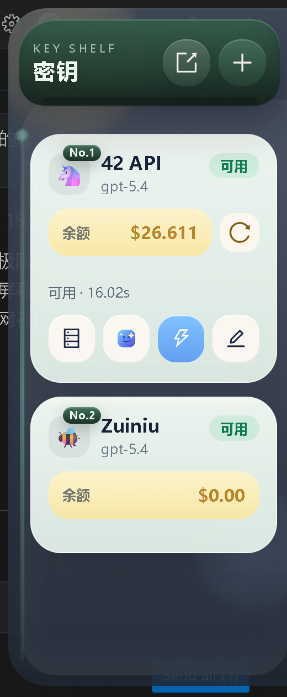

<div align="center">


**Desktop app for batch API checks, key handling, and client switching**

<p>
Supports browser-extension import, model discovery, availability checks, and config switching for Claude, Codex, OpenCode, and OpenClaw.
</p>

<p align="center">
<a href="https://github.com/jlwebs/AllApiDeck/releases">
  
</a><!--
--><a href="https://github.com/jlwebs/AllApiDeck/stargazers">
  
</a><!--
--><a href="https://deepwiki.com/jlwebs/AllApiDeck">
  
</a><!--
--><a href="../../LICENSE">
  
</a><!--
--><!--
-->
</p>

<p align="center">
  <a href="../../README.md">中文</a> |
  <a href="./README.en.md"><strong>English</strong></a>
</p>

</div>
## Preview




## Positioning

This is not just a web page utility. It is a local desktop workflow app.

The project currently has three main layers:

- Desktop shell: `Wails`
- Frontend UI: `Vue 3 + Ant Design Vue + Vite`
- Local backend logic: `Go`

## Main Features

### 1. Extension-first import

Supports direct import from ALL-API-HUB browser extension data, which is recommended when extension data is already available.

### 2. Backup JSON import

Supports importing standard backup files exported by the ALL-API-HUB extension, for example:

- `accounts-backup.json`
- `accounts-backup-2026-04-01.json`

### 3. Batch model discovery

Fetches model lists concurrently from imported sites, with failure diagnostics, status tracking, and tag grouping.

### 4. Batch availability checks

Supports batch testing on selected sites and models, including:

- Available / failed status
- Error codes
- Common reason hints
- Trace logs for investigation
- Fetch snippets for reproduction

### 5. Local Profile / CDP dual mode

Supports two login-state reading modes:

- `Profile file mode`
- `CDP reopen mode`

These can be switched in settings depending on compatibility needs across different sites.

### 6. Side panel

After minimizing to tray, the side panel can be used to manage key records with:

- Quick balance refresh
- Quick testing
- Model selection
- One-click open for the dedicated config window

### 7. Dedicated one-click config

Based on the currently selected site record, the app can generate a config diff preview and write the result into local desktop client config files.

Supported target apps currently include:

- Claude
- Codex
- OpenCode
- OpenClaw

## Project Structure

```text
.
├─ src/                     Frontend pages and components
├─ wailsjs/                 Wails binding code
├─ build/                   Build output
├─ logs/                    Runtime logs
├─ scripts/                 Dev and build scripts
├─ main.go                  Wails entry
├─ app.go                   App lifecycle and backend core logic
├─ window_sidebar.go        Tray / side panel window logic
└─ local_api.go             Local API and request handling
```

## Development Environment

Recommended environment:

- Windows 10/11
- Go 1.24+
- Node.js 24+
- npm 11+
- WebView2 Runtime

## Development

Install dependencies:

```bash
npm install
```

Desktop dev mode:

```bash
npm run dev
```

Frontend-only dev mode:

```bash
npm run dev:web
```

## Build

Desktop build:

```bash
wails build
```

Or:

```bash
npm run build:desktop
```

Build output is generated by default in:

```text
build/bin/
```

GitHub Release desktop assets currently include:

- Windows: `allapideck-windows-amd64.exe`
- macOS: `allapideck-macos-universal.dmg`
- Linux: `allapideck-linux-amd64.tar.gz`
- Linux AppImage: `allapideck-linux-amd64.AppImage`
- Linux DEB: `allapideck-linux-amd64.deb`

The Linux packages are assembled manually in CI on top of the Wails build output because Wails v2 does not generate `.deb` or `AppImage` release artifacts by itself.

## Logs

Logs are also available from the settings page. The main log directory is:

```text
logs/
```

Typical files include:

- `EXE_BACKEND_DEBUG.log`
- `wails-dev-host.log`
- `wails-dev-runner.log`
- `wails-dev-vite.log`

## GitHub

Project homepage:

https://github.com/jlwebs/AllApiDeck

## Acknowledgements

Thanks to the [Linux.do](https://linux.do/) community for feedback, testing, and word-of-mouth support.
